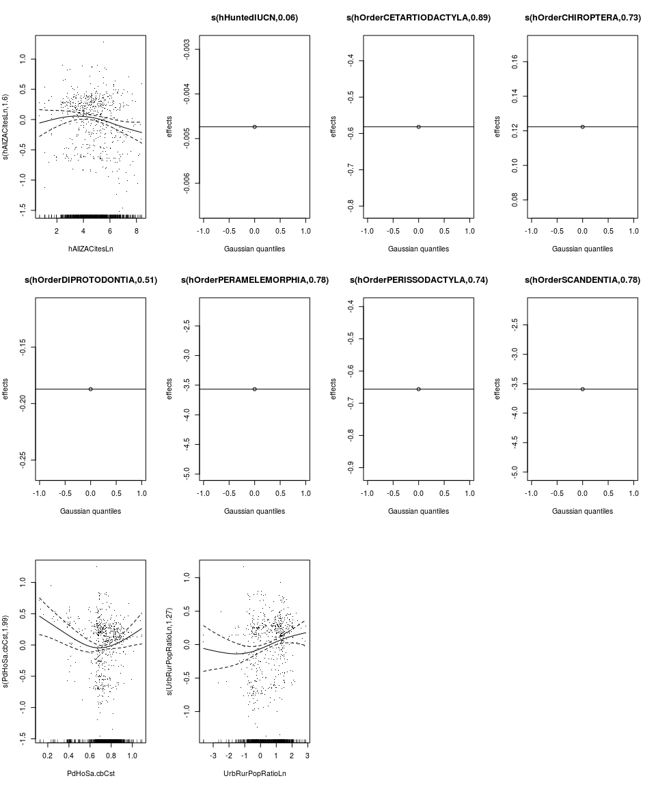
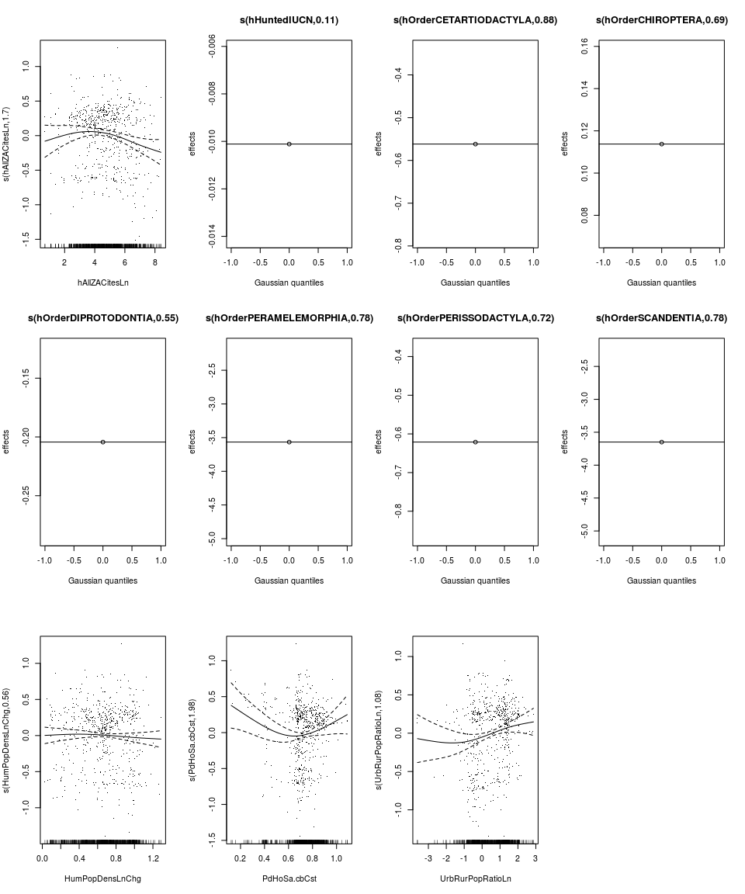
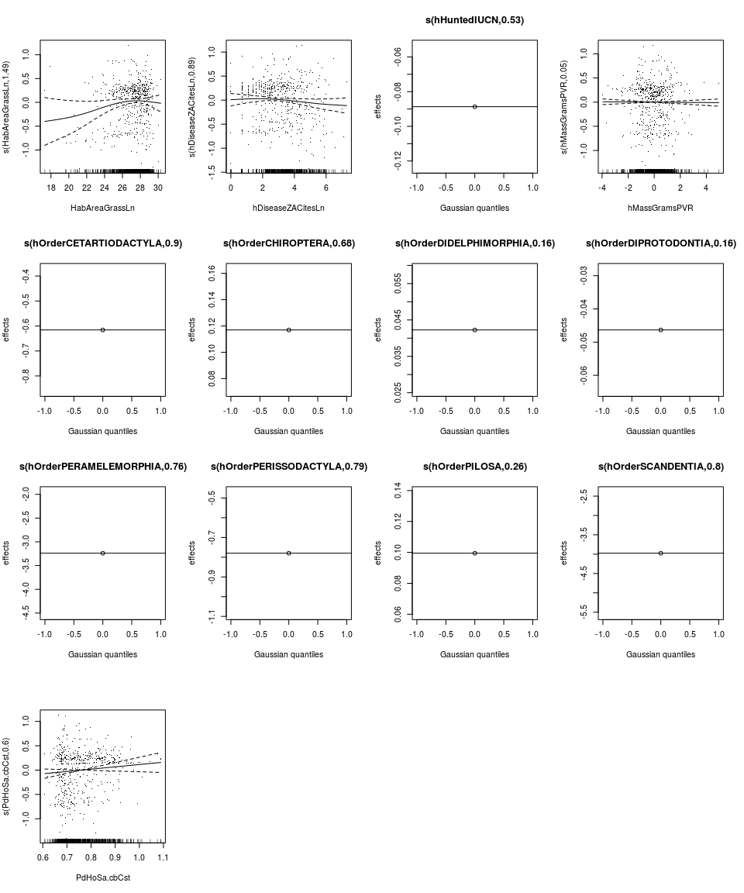
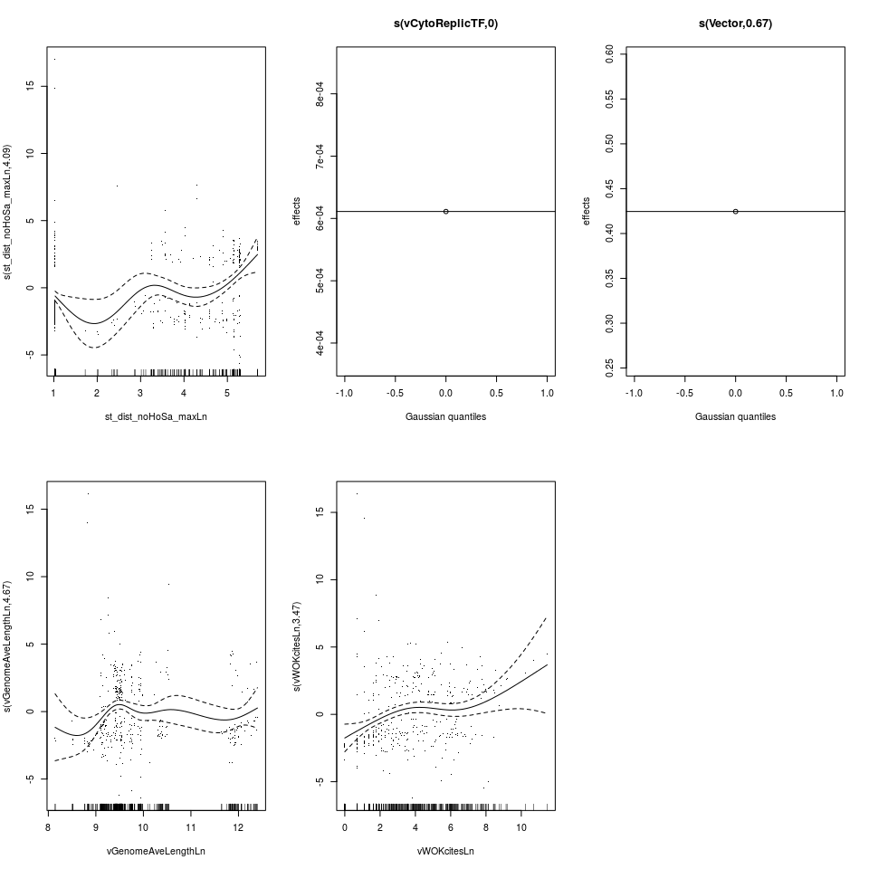
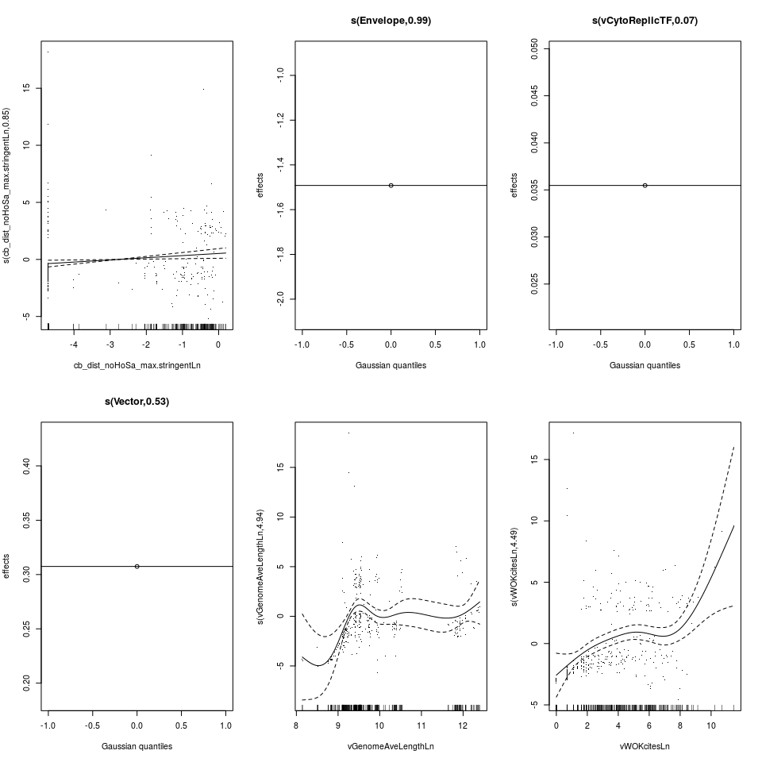
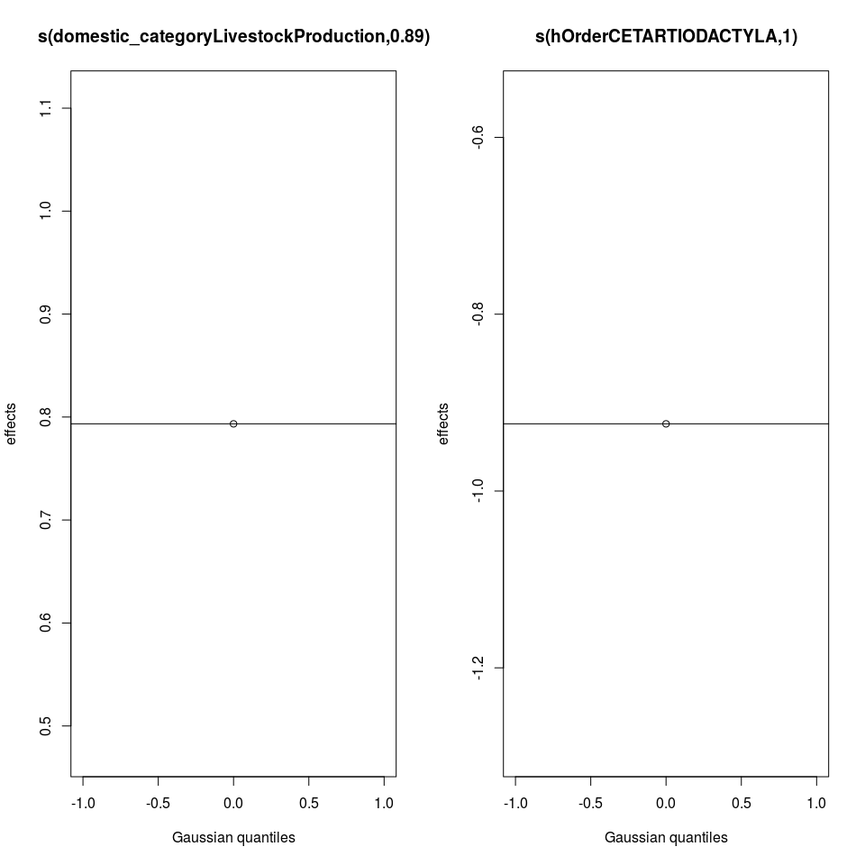

# Supplementary Information: GAM Models


# Zoonoses GAM - All Associations


Terms in models with ΔAIC < 2.  All continuous terms effects are represented
as splines, all discrete terms as random effects:


      ΔAIC  Terms in Model                                                                                                                                                                                                               
----------  -----------------------------------------------------------------------------------------------------------------------------------------------------------------------------------------------------------------------------
 0.0000000  offset(LnTotNumVirus) + hAllZACitesLn + hHuntedIUCN + hOrderCETARTIODACTYLA + hOrderCHIROPTERA + hOrderDIPROTODONTIA + hOrderPERAMELEMORPHIA + hOrderPERISSODACTYLA + hOrderSCANDENTIA + PdHoSa.cbCst + UrbRurPopRatioLn     
 0.4928126  offset(LnTotNumVirus) + hAllZACitesLn + hOrderCETARTIODACTYLA + hOrderCHIROPTERA + hOrderDIPROTODONTIA + hOrderPERAMELEMORPHIA + hOrderPERISSODACTYLA + hOrderSCANDENTIA + HumPopDensLnChg + PdHoSaSTPD + UrbRurPopRatioLn   
 1.5419086  offset(LnTotNumVirus) + hDiseaseZACitesLn + hHuntedIUCN + hOrderCETARTIODACTYLA + hOrderCHIROPTERA + hOrderDIPROTODONTIA + hOrderPERAMELEMORPHIA + hOrderPERISSODACTYLA + hOrderSCANDENTIA + PdHoSa.cbCst + UrbRurPopRatioLn 

Partial effect plots of all terms in top model:

<!-- -->

Summary of top model:


```
## 
## Family: poisson 
## Link function: log 
## 
## Formula:
## NSharedWithHoSa ~ s(hAllZACitesLn, bs = "tp", k = 7) + s(hHuntedIUCN, 
##     bs = "re") + s(hOrderCETARTIODACTYLA, bs = "re") + s(hOrderCHIROPTERA, 
##     bs = "re") + s(hOrderDIPROTODONTIA, bs = "re") + s(hOrderPERAMELEMORPHIA, 
##     bs = "re") + s(hOrderPERISSODACTYLA, bs = "re") + s(hOrderSCANDENTIA, 
##     bs = "re") + s(PdHoSa.cbCst, bs = "tp", k = 7) + s(UrbRurPopRatioLn, 
##     bs = "tp", k = 7) + offset(LnTotNumVirus)
## 
## Parametric coefficients:
##             Estimate Std. Error z value Pr(>|z|)    
## (Intercept) -0.35144    0.03922   -8.96   <2e-16 ***
## ---
## Signif. codes:  0 '***' 0.001 '**' 0.01 '*' 0.05 '.' 0.1 ' ' 1
## 
## Approximate significance of smooth terms:
##                              edf Ref.df Chi.sq  p-value    
## s(hAllZACitesLn)         1.60480      6  9.183 0.004625 ** 
## s(hHuntedIUCN)           0.05738      1  0.073 0.259633    
## s(hOrderCETARTIODACTYLA) 0.89453      1 26.091 1.13e-07 ***
## s(hOrderCHIROPTERA)      0.73008      1  4.825 0.013462 *  
## s(hOrderDIPROTODONTIA)   0.51444      1  0.957 0.172999    
## s(hOrderPERAMELEMORPHIA) 0.78099      1  0.756 0.325013    
## s(hOrderPERISSODACTYLA)  0.74243      1  2.950 0.046660 *  
## s(hOrderSCANDENTIA)      0.78219      1  0.812 0.308369    
## s(PdHoSa.cbCst)          1.99407      6 15.387 0.000329 ***
## s(UrbRurPopRatioLn)      1.26905      6 10.652 0.001563 ** 
## ---
## Signif. codes:  0 '***' 0.001 '**' 0.01 '*' 0.05 '.' 0.1 ' ' 1
## 
## R-sq.(adj) =  0.895   Deviance explained = 34.1%
## UBRE = -0.60478  Scale est. = 1         n = 584
```


# Zoonoses GAM - Strict Associations


Terms in models with ΔAIC < 2.  All continuous terms effects are represented
as splines, all discrete terms as random effects:


 ΔAIC  Terms in Model                                                                                                                                                                                                          
-----  ------------------------------------------------------------------------------------------------------------------------------------------------------------------------------------------------------------------------
    0  offset(LnTotNumVirus) + hDiseaseZACitesLn + hMassGramsPVR + hOrderCETARTIODACTYLA + hOrderDIPROTODONTIA + hOrderLAGOMORPHA + hOrderPERISSODACTYLA + hOrderPRIMATES + HumPopDensLnChg + PdHoSa.cbCst + UrbRurPopRatioChg 

Partial effect plots of all terms in top model:

<!-- -->

Summary of top model:


```
## 
## Family: poisson 
## Link function: log 
## 
## Formula:
## NSharedWithHoSa_strict ~ s(hDiseaseZACitesLn, bs = "tp", k = 7) + 
##     s(hMassGramsPVR, bs = "tp", k = 7) + s(hOrderCETARTIODACTYLA, 
##     bs = "re") + s(hOrderDIPROTODONTIA, bs = "re") + s(hOrderLAGOMORPHA, 
##     bs = "re") + s(hOrderPERISSODACTYLA, bs = "re") + s(hOrderPRIMATES, 
##     bs = "re") + s(HumPopDensLnChg, bs = "tp", k = 7) + s(PdHoSa.cbCst, 
##     bs = "tp", k = 7) + s(UrbRurPopRatioChg, bs = "tp", k = 7) + 
##     offset(LnTotNumVirus)
## 
## Parametric coefficients:
##             Estimate Std. Error z value Pr(>|z|)    
## (Intercept) -1.34951    0.05957  -22.66   <2e-16 ***
## ---
## Signif. codes:  0 '***' 0.001 '**' 0.01 '*' 0.05 '.' 0.1 ' ' 1
## 
## Approximate significance of smooth terms:
##                             edf Ref.df Chi.sq  p-value    
## s(hDiseaseZACitesLn)     1.2094      6  5.034  0.01426 *  
## s(hMassGramsPVR)         0.1155      6  0.122  0.29403    
## s(hOrderCETARTIODACTYLA) 0.9429      1 22.929 7.48e-07 ***
## s(hOrderDIPROTODONTIA)   0.7079      1  2.388  0.06601 .  
## s(hOrderLAGOMORPHA)      0.4215      1  0.704  0.19560    
## s(hOrderPERISSODACTYLA)  0.8255      1  0.859  0.30760    
## s(hOrderPRIMATES)        0.2845      1  0.621  0.09683 .  
## s(HumPopDensLnChg)       1.4738      6  3.164  0.13164    
## s(PdHoSa.cbCst)          2.3586      6 56.125 8.67e-06 ***
## s(UrbRurPopRatioChg)     4.0467      6 16.880  0.00208 ** 
## ---
## Signif. codes:  0 '***' 0.001 '**' 0.01 '*' 0.05 '.' 0.1 ' ' 1
## 
## R-sq.(adj) =  0.654   Deviance explained = 23.6%
## UBRE = -0.15735  Scale est. = 1         n = 576
```

# Zoonoses GAM - All Associations without Reverse Zoonoses


Terms in models with ΔAIC < 2.  All continuous terms effects are represented
as splines, all discrete terms as random effects:


     ΔAIC  Terms in Model                                                                                                                                                                                                                             
---------  -------------------------------------------------------------------------------------------------------------------------------------------------------------------------------------------------------------------------------------------
 0.000000  offset(LnTotNumVirus) + hAllZACitesLn + hHuntedIUCN + hOrderCETARTIODACTYLA + hOrderCHIROPTERA + hOrderDIPROTODONTIA + hOrderPERAMELEMORPHIA + hOrderPERISSODACTYLA + hOrderSCANDENTIA + HumPopDensLnChg + PdHoSa.cbCst + UrbRurPopRatioLn 
 1.861192  offset(LnTotNumVirus) + hAllZACitesLn + hOrderCETARTIODACTYLA + hOrderCHIROPTERA + hOrderDIPROTODONTIA + hOrderPERAMELEMORPHIA + hOrderPERISSODACTYLA + hOrderSCANDENTIA + HumPopDensLnChg + PdHoSaSTPD + UrbRurPopRatioLn                 

Partial effect plots of all terms in top model:

<!-- -->

Summary of top model:


```
## 
## Family: poisson 
## Link function: log 
## 
## Formula:
## NSharedWithHoSa_norev ~ s(hAllZACitesLn, bs = "tp", k = 7) + 
##     s(hHuntedIUCN, bs = "re") + s(hOrderCETARTIODACTYLA, bs = "re") + 
##     s(hOrderCHIROPTERA, bs = "re") + s(hOrderDIPROTODONTIA, bs = "re") + 
##     s(hOrderPERAMELEMORPHIA, bs = "re") + s(hOrderPERISSODACTYLA, 
##     bs = "re") + s(hOrderSCANDENTIA, bs = "re") + s(HumPopDensLnChg, 
##     bs = "tp", k = 7) + s(PdHoSa.cbCst, bs = "tp", k = 7) + s(UrbRurPopRatioLn, 
##     bs = "tp", k = 7) + offset(LnTotNumVirus)
## 
## Parametric coefficients:
##             Estimate Std. Error z value Pr(>|z|)    
## (Intercept) -0.35794    0.03935  -9.097   <2e-16 ***
## ---
## Signif. codes:  0 '***' 0.001 '**' 0.01 '*' 0.05 '.' 0.1 ' ' 1
## 
## Approximate significance of smooth terms:
##                             edf Ref.df Chi.sq  p-value    
## s(hAllZACitesLn)         1.7011      6  9.812  0.00314 ** 
## s(hHuntedIUCN)           0.1146      1  0.165  0.23214    
## s(hOrderCETARTIODACTYLA) 0.8808      1 24.733 1.82e-07 ***
## s(hOrderCHIROPTERA)      0.6878      1  4.293  0.01529 *  
## s(hOrderDIPROTODONTIA)   0.5497      1  1.056  0.16611    
## s(hOrderPERAMELEMORPHIA) 0.7809      1  0.753  0.32600    
## s(hOrderPERISSODACTYLA)  0.7236      1  2.739  0.05205 .  
## s(hOrderSCANDENTIA)      0.7849      1  0.804  0.31136    
## s(HumPopDensLnChg)       0.5637      6  0.857  0.20308    
## s(PdHoSa.cbCst)          1.9849      6 10.598  0.00353 ** 
## s(UrbRurPopRatioLn)      1.0754      6  7.484  0.00305 ** 
## ---
## Signif. codes:  0 '***' 0.001 '**' 0.01 '*' 0.05 '.' 0.1 ' ' 1
## 
## R-sq.(adj) =  0.883   Deviance explained = 32.6%
## UBRE = -0.58201  Scale est. = 1         n = 583
```

# Zoonoses GAM - All Associations without Primates


Terms in models with ΔAIC < 2.  All continuous terms effects are represented
as splines, all discrete terms as random effects:


     ΔAIC  Terms in Model                                                                                                                                                                                                                                                     
---------  -------------------------------------------------------------------------------------------------------------------------------------------------------------------------------------------------------------------------------------------------------------------
 0.000000  offset(LnTotNumVirus) + hAllZACitesLn + hHuntedIUCN + hOrderCETARTIODACTYLA + hOrderCHIROPTERA + hOrderDIDELPHIMORPHIA + hOrderDIPROTODONTIA + hOrderPERAMELEMORPHIA + hOrderPERISSODACTYLA + hOrderSCANDENTIA + HumPopDensLnChg + PdHoSa.cbCst + UrbRurPopRatioLn 
 1.723904  offset(LnTotNumVirus) + hAllZACitesLn + hHuntedIUCN + hOrderCETARTIODACTYLA + hOrderCHIROPTERA + hOrderDIPROTODONTIA + hOrderPERAMELEMORPHIA + hOrderPERISSODACTYLA + hOrderSCANDENTIA + PdHoSa.cbCst + TotHumPopLn + UrbRurPopRatioLn                             

Partial effect plots of all terms in top model:

<!-- -->

Summary of top model:


```
## 
## Family: poisson 
## Link function: log 
## 
## Formula:
## NSharedWithHoSa ~ s(hAllZACitesLn, bs = "tp", k = 7) + s(hHuntedIUCN, 
##     bs = "re") + s(hOrderCETARTIODACTYLA, bs = "re") + s(hOrderCHIROPTERA, 
##     bs = "re") + s(hOrderDIDELPHIMORPHIA, bs = "re") + s(hOrderDIPROTODONTIA, 
##     bs = "re") + s(hOrderPERAMELEMORPHIA, bs = "re") + s(hOrderPERISSODACTYLA, 
##     bs = "re") + s(hOrderSCANDENTIA, bs = "re") + s(HumPopDensLnChg, 
##     bs = "tp", k = 7) + s(PdHoSa.cbCst, bs = "tp", k = 7) + s(UrbRurPopRatioLn, 
##     bs = "tp", k = 7) + offset(LnTotNumVirus)
## 
## Parametric coefficients:
##             Estimate Std. Error z value Pr(>|z|)    
## (Intercept) -0.35657    0.04459  -7.996 1.29e-15 ***
## ---
## Signif. codes:  0 '***' 0.001 '**' 0.01 '*' 0.05 '.' 0.1 ' ' 1
## 
## Approximate significance of smooth terms:
##                             edf Ref.df Chi.sq  p-value    
## s(hAllZACitesLn)         1.4641      6  7.629  0.00786 ** 
## s(hHuntedIUCN)           0.4817      1  1.903  0.06388 .  
## s(hOrderCETARTIODACTYLA) 0.8454      1 21.111 3.61e-06 ***
## s(hOrderCHIROPTERA)      0.6845      1  5.057  0.00901 ** 
## s(hOrderDIDELPHIMORPHIA) 0.1737      1  0.236  0.23765    
## s(hOrderDIPROTODONTIA)   0.5713      1  1.152  0.15707    
## s(hOrderPERAMELEMORPHIA) 0.7831      1  0.761  0.32442    
## s(hOrderPERISSODACTYLA)  0.6729      1  2.213  0.07114 .  
## s(hOrderSCANDENTIA)      0.7880      1  0.794  0.31557    
## s(HumPopDensLnChg)       0.9159      6  1.709  0.15037    
## s(PdHoSa.cbCst)          0.3305      6  0.851  0.11573    
## s(UrbRurPopRatioLn)      0.7208      6  8.424  0.00143 ** 
## ---
## Signif. codes:  0 '***' 0.001 '**' 0.01 '*' 0.05 '.' 0.1 ' ' 1
## 
## R-sq.(adj) =   0.88   Deviance explained = 36.4%
## UBRE = -0.59838  Scale est. = 1         n = 510
```


# All Viruses GAM - All Associations


Terms in models with ΔAIC < 2.  All continuous terms effects are represented
as splines, all discrete terms as random effects:


 ΔAIC  Terms in Model                                                                                                                                                                
-----  ------------------------------------------------------------------------------------------------------------------------------------------------------------------------------
    0  hDiseaseZACitesLn + hMassGramsPVR + hOrderCETARTIODACTYLA + hOrderCHIROPTERA + hOrderEULIPOTYPHLA + hOrderPERISSODACTYLA + hOrderPRIMATES + hOrderRODENTIA + LnAreaHost + S20 

Partial effect plots of all terms in top model:

<!-- -->

Summary of top model:


```
## 
## Family: poisson 
## Link function: log 
## 
## Formula:
## TotVirusPerHost ~ s(hDiseaseZACitesLn, bs = "cs", k = 7) + s(hMassGramsPVR, 
##     bs = "cs", k = 7) + s(hOrderCETARTIODACTYLA, bs = "re") + 
##     s(hOrderCHIROPTERA, bs = "re") + s(hOrderEULIPOTYPHLA, bs = "re") + 
##     s(hOrderPERISSODACTYLA, bs = "re") + s(hOrderPRIMATES, bs = "re") + 
##     s(hOrderRODENTIA, bs = "re") + s(LnAreaHost, bs = "cs", k = 7) + 
##     s(S20, bs = "cs", k = 7)
## 
## Parametric coefficients:
##             Estimate Std. Error z value Pr(>|z|)    
## (Intercept)  0.51806    0.06972   7.431 1.08e-13 ***
## ---
## Signif. codes:  0 '***' 0.001 '**' 0.01 '*' 0.05 '.' 0.1 ' ' 1
## 
## Approximate significance of smooth terms:
##                             edf Ref.df   Chi.sq  p-value    
## s(hDiseaseZACitesLn)     5.5484      6 1846.572  < 2e-16 ***
## s(hMassGramsPVR)         3.8207      6  216.421 0.008539 ** 
## s(hOrderCETARTIODACTYLA) 0.9355      1   24.370 0.000231 ***
## s(hOrderCHIROPTERA)      1.0000      1  155.124 2.49e-16 ***
## s(hOrderEULIPOTYPHLA)    0.8482      1    5.867 0.008946 ** 
## s(hOrderPERISSODACTYLA)  0.9999      1    9.949 0.001317 ** 
## s(hOrderPRIMATES)        0.9427      1   34.403 1.52e-05 ***
## s(hOrderRODENTIA)        0.9954      1   95.491 8.53e-09 ***
## s(LnAreaHost)            3.5806      6   18.930 0.024928 *  
## s(S20)                   5.1611      6  301.384 7.25e-15 ***
## ---
## Signif. codes:  0 '***' 0.001 '**' 0.01 '*' 0.05 '.' 0.1 ' ' 1
## 
## R-sq.(adj) =  0.494   Deviance explained = 49.3%
## UBRE = 0.36401  Scale est. = 1         n = 576
```


# All Viruses GAM - Strict Associations


Terms in models with ΔAIC < 2.  All continuous terms effects are represented
as splines, all discrete terms as random effects:


 ΔAIC  Terms in Model                                                                                                                                                                              
-----  --------------------------------------------------------------------------------------------------------------------------------------------------------------------------------------------
    0  hDiseaseZACitesLn + hMassGramsPVR + hOrderCHIROPTERA + hOrderCINGULATA + hOrderEULIPOTYPHLA + hOrderPERAMELEMORPHIA + hOrderPRIMATES + hOrderRODENTIA + hOrderSCANDENTIA + LnAreaHost + S20 

Partial effect plots of all terms in top model:

<!-- -->

Summary of top model:


```
## 
## Family: poisson 
## Link function: log 
## 
## Formula:
## TotVirusPerHost_strict ~ s(hDiseaseZACitesLn, bs = "cs", k = 7) + 
##     s(hMassGramsPVR, bs = "cs", k = 7) + s(hOrderCHIROPTERA, 
##     bs = "re") + s(hOrderCINGULATA, bs = "re") + s(hOrderEULIPOTYPHLA, 
##     bs = "re") + s(hOrderPERAMELEMORPHIA, bs = "re") + s(hOrderPRIMATES, 
##     bs = "re") + s(hOrderRODENTIA, bs = "re") + s(hOrderSCANDENTIA, 
##     bs = "re") + s(LnAreaHost, bs = "cs", k = 7) + s(S20, bs = "cs", 
##     k = 7)
## 
## Parametric coefficients:
##             Estimate Std. Error z value Pr(>|z|)    
## (Intercept) -0.46816    0.08818  -5.309  1.1e-07 ***
## ---
## Signif. codes:  0 '***' 0.001 '**' 0.01 '*' 0.05 '.' 0.1 ' ' 1
## 
## Approximate significance of smooth terms:
##                             edf Ref.df  Chi.sq  p-value    
## s(hDiseaseZACitesLn)     4.9779      6 923.024  < 2e-16 ***
## s(hMassGramsPVR)         3.5116      6   9.646 0.035625 *  
## s(hOrderCHIROPTERA)      0.9999      1 109.230 5.11e-14 ***
## s(hOrderCINGULATA)       0.7633      1   0.868 0.286385    
## s(hOrderEULIPOTYPHLA)    0.5887      1   1.210 0.150553    
## s(hOrderPERAMELEMORPHIA) 0.7049      1   0.737 0.306647    
## s(hOrderPRIMATES)        0.9998      1  85.119 4.92e-14 ***
## s(hOrderRODENTIA)        0.9766      1 129.283 8.62e-15 ***
## s(hOrderSCANDENTIA)      0.4108      1   0.941 0.130105    
## s(LnAreaHost)            2.6550      6  11.138 0.078928 .  
## s(S20)                   4.6935      6  44.963 0.000481 ***
## ---
## Signif. codes:  0 '***' 0.001 '**' 0.01 '*' 0.05 '.' 0.1 ' ' 1
## 
## R-sq.(adj) =  0.419   Deviance explained = 35.8%
## UBRE =   0.38  Scale est. = 1         n = 575
```


# Viral Traits GAM - All Associations


Terms in models with ΔAIC < 2.  All continuous terms effects are represented
as splines, all discrete terms as random effects:


      ΔAIC  Terms in Model                                                                                 
----------  -----------------------------------------------------------------------------------------------
 0.0000000  Envelope + st_dist_noHoSa_maxLn + vCytoReplicTF + Vector + vGenomeAveLengthLn + vWOKcitesLn    
 0.7123169  Envelope + st_dist_noHoSa_maxLn + vCytoReplicTF + Vector + vGenomeAveLengthLn + vPubMedCitesLn 

Partial effect plots of all terms in top model:

<!-- -->

Summary of top model:


```
## 
## Family: binomial 
## Link function: logit 
## 
## Formula:
## IsZoonotic ~ s(Envelope, bs = "re") + s(st_dist_noHoSa_maxLn, 
##     bs = "tp", k = 7) + s(vCytoReplicTF, bs = "re") + s(Vector, 
##     bs = "re") + s(vGenomeAveLengthLn, bs = "tp", k = 7) + s(vWOKcitesLn, 
##     bs = "tp", k = 7)
## 
## Parametric coefficients:
##             Estimate Std. Error z value Pr(>|z|)    
## (Intercept)  -1.2265     0.3101  -3.955 7.64e-05 ***
## ---
## Signif. codes:  0 '***' 0.001 '**' 0.01 '*' 0.05 '.' 0.1 ' ' 1
## 
## Approximate significance of smooth terms:
##                            edf Ref.df Chi.sq  p-value    
## s(Envelope)             0.7720      1  3.399   0.0370 *  
## s(st_dist_noHoSa_maxLn) 3.9972      6 41.831 2.46e-08 ***
## s(vCytoReplicTF)        0.5080      1  1.689   0.0723 .  
## s(Vector)               0.7199      1  4.191   0.0171 *  
## s(vGenomeAveLengthLn)   1.2807      6  2.560   0.1745    
## s(vWOKcitesLn)          3.4948      6 26.178 1.40e-05 ***
## ---
## Signif. codes:  0 '***' 0.001 '**' 0.01 '*' 0.05 '.' 0.1 ' ' 1
## 
## R-sq.(adj) =  0.343   Deviance explained = 30.3%
## UBRE = 0.015372  Scale est. = 1         n = 348
```


# Viral Traits GAM - Strict Associations


Terms in models with ΔAIC < 2.  All continuous terms effects are represented
as splines, all discrete terms as random effects:


      ΔAIC  Terms in Model                                                                                              
----------  ------------------------------------------------------------------------------------------------------------
 0.0000000  cb_dist_noHoSa_mean.stringentLn + Envelope + vCytoReplicTF + Vector + vGenomeAveLengthLn + vPubMedCitesLn   
 0.2059789  cb_dist_noHoSa_median.stringentLn + Envelope + vCytoReplicTF + Vector + vGenomeAveLengthLn + vPubMedCitesLn 

Partial effect plots of all terms in top model:

<!-- -->

Summary of top model:


```
## 
## Family: binomial 
## Link function: logit 
## 
## Formula:
## IsZoonotic.stringent ~ s(cb_dist_noHoSa_mean.stringentLn, bs = "tp", 
##     k = 7) + s(Envelope, bs = "re") + s(vCytoReplicTF, bs = "re") + 
##     s(Vector, bs = "re") + s(vGenomeAveLengthLn, bs = "tp", k = 7) + 
##     s(vPubMedCitesLn, bs = "tp", k = 7)
## 
## Parametric coefficients:
##             Estimate Std. Error z value Pr(>|z|)    
## (Intercept)  -1.7863     0.3513  -5.085 3.67e-07 ***
## ---
## Signif. codes:  0 '***' 0.001 '**' 0.01 '*' 0.05 '.' 0.1 ' ' 1
## 
## Approximate significance of smooth terms:
##                                       edf Ref.df Chi.sq  p-value    
## s(cb_dist_noHoSa_mean.stringentLn) 0.9319      6 11.836 0.000402 ***
## s(Envelope)                        0.3590      1  0.453 0.262487    
## s(vCytoReplicTF)                   0.6943      1  3.178 0.042513 *  
## s(Vector)                          0.7710      1  3.671 0.033527 *  
## s(vGenomeAveLengthLn)              1.4642      6  2.119 0.253498    
## s(vPubMedCitesLn)                  3.9631      6 24.536 3.17e-05 ***
## ---
## Signif. codes:  0 '***' 0.001 '**' 0.01 '*' 0.05 '.' 0.1 ' ' 1
## 
## R-sq.(adj) =  0.222   Deviance explained = 22.6%
## UBRE = -0.033645  Scale est. = 1         n = 289
```


# Zoonoses in Domestic Animals GAM - All Associations


Terms in models with ΔAIC < 2.  All continuous terms effects are represented
as splines, all discrete terms as random effects:


      ΔAIC  Terms in Model                                                                                          
----------  --------------------------------------------------------------------------------------------------------
 0.0000000  offset(LnTotNumVirus) + domestic_categoryLivestockProduction + hOrderCETARTIODACTYLA                    
 0.0413592  offset(LnTotNumVirus) + domestic_categoryLivestockProduction + hOrderCETARTIODACTYLA + hOrderLAGOMORPHA 

Partial effect plots of all terms in top model:

<!-- -->

Summary of top model:


```
## 
## Family: poisson 
## Link function: log 
## 
## Formula:
## NSharedWithHoSa ~ s(domestic_categoryLivestockProduction, bs = "re") + 
##     s(hOrderCETARTIODACTYLA, bs = "re") + offset(LnTotNumVirus)
## 
## Parametric coefficients:
##             Estimate Std. Error z value Pr(>|z|)    
## (Intercept) -0.60693    0.09325  -6.509 7.58e-11 ***
## ---
## Signif. codes:  0 '***' 0.001 '**' 0.01 '*' 0.05 '.' 0.1 ' ' 1
## 
## Approximate significance of smooth terms:
##                                            edf Ref.df Chi.sq p-value   
## s(domestic_categoryLivestockProduction) 0.8861      1  68.07 0.00439 **
## s(hOrderCETARTIODACTYLA)                0.9999      1  97.22 0.00205 **
## ---
## Signif. codes:  0 '***' 0.001 '**' 0.01 '*' 0.05 '.' 0.1 ' ' 1
## 
## R-sq.(adj) =   0.96   Deviance explained =   38%
## UBRE = -0.17089  Scale est. = 1         n = 32
```


# Zoonoses in Domestic Animals GAM - Strict Associations


Terms in models with ΔAIC < 2.  All continuous terms effects are represented
as splines, all discrete terms as random effects:


      ΔAIC  Terms in Model                                                                                                                                
----------  ----------------------------------------------------------------------------------------------------------------------------------------------
 0.0000000  offset(LnTotNumVirus) + hOrderLAGOMORPHA + hOrderPROBOSCIDEA + hOrderRODENTIA                                                                 
 0.0005550  offset(LnTotNumVirus) + hOrderLAGOMORPHA + hOrderPROBOSCIDEA                                                                                  
 0.3074961  offset(LnTotNumVirus) + hOrderLAGOMORPHA + hOrderRODENTIA                                                                                     
 0.3115803  offset(LnTotNumVirus) + hOrderLAGOMORPHA                                                                                                      
 0.6164310  offset(LnTotNumVirus) + hOrderPROBOSCIDEA + hOrderRODENTIA                                                                                    
 0.6978756  offset(LnTotNumVirus) + hOrderPROBOSCIDEA                                                                                                     
 0.7057037  offset(LnTotNumVirus) + domestic_categoryOther + hOrderPROBOSCIDEA                                                                            
 0.8929570  offset(LnTotNumVirus) + domestic_categorySmallExoticFarming + hMassGramsPVR + hOrderRODENTIA + LnDOMYearBP                                    
 0.9226537  offset(LnTotNumVirus) + domestic_categorySmallExoticFarming + hOrderRODENTIA + LnDOMYearBP                                                    
 1.0015364  offset(LnTotNumVirus) + hOrderRODENTIA                                                                                                        
 1.0422320  offset(LnTotNumVirus) + domestic_categorySmallExoticFarming + hMassGramsPVR + hOrderRODENTIA + LnDOMYearBP + PdHoSa.cbCst                     
 1.0604040  offset(LnTotNumVirus) + domestic_categorySmallExoticFarming + hOrderLAGOMORPHA + hOrderRODENTIA + LnDOMYearBP                                 
 1.0695974  offset(LnTotNumVirus) + domestic_categorySmallExoticFarming + hOrderLAGOMORPHA + hOrderPROBOSCIDEA + hOrderRODENTIA + LnDOMYearBP             
 1.0738794  offset(LnTotNumVirus)                                                                                                                         
 1.0738794  +offset(LnTotNumVirus)                                                                                                                        
 1.0741740  offset(LnTotNumVirus) + domestic_categoryOther                                                                                                
 1.1158737  offset(LnTotNumVirus) + domestic_categorySmallExoticFarming + hOrderRODENTIA + LnDOMYearBP + PdHoSa.cbCst                                     
 1.1850913  offset(LnTotNumVirus) + domestic_categorySmallExoticFarming + hMassGramsPVR + hOrderLAGOMORPHA + hOrderRODENTIA + LnDOMYearBP                 
 1.5035833  offset(LnTotNumVirus) + domestic_categorySmallExoticFarming + hAllZACitesLn + hOrderRODENTIA + LnDOMYearBP + PdHoSa.cbCst                     
 1.5622911  offset(LnTotNumVirus) + domestic_categorySmallExoticFarming + hDiseaseZACitesLn + hOrderRODENTIA + LnDOMYearBP + PdHoSa.cbCst                 
 1.5691890  offset(LnTotNumVirus) + domestic_categorySmallExoticFarming + hDiseaseZACitesLn + hMassGramsPVR + hOrderRODENTIA + LnDOMYearBP + PdHoSa.cbCst 
 1.8493075  offset(LnTotNumVirus) + domestic_categoryOther + domestic_categorySmallExoticFarming + LnDOMYearBP                                            
 1.8574597  offset(LnTotNumVirus) + domestic_categoryOther + domestic_categorySmallExoticFarming + hOrderLAGOMORPHA + hOrderPROBOSCIDEA + LnDOMYearBP     
 1.8575925  offset(LnTotNumVirus) + domestic_categoryOther + domestic_categorySmallExoticFarming + hOrderLAGOMORPHA + LnDOMYearBP                         
 1.8765366  offset(LnTotNumVirus) + domestic_categorySmallExoticFarming + hAllZACitesLn + hOrderLAGOMORPHA + hOrderRODENTIA + LnDOMYearBP + PdHoSa.cbCst  
 1.9380815  offset(LnTotNumVirus) + domestic_categoryOther + domestic_categorySmallExoticFarming + hMassGramsPVR + LnDOMYearBP                            

Partial effect plots of all terms in top model:

<!-- -->

Summary of top model:


```
## 
## Family: poisson 
## Link function: log 
## 
## Formula:
## NSharedWithHoSa_strict ~ offset(LnTotNumVirus) + s(hOrderLAGOMORPHA, 
##     bs = "re") + s(hOrderPROBOSCIDEA, bs = "re") + s(hOrderRODENTIA, 
##     bs = "re")
## 
## Parametric coefficients:
##             Estimate Std. Error z value Pr(>|z|)    
## (Intercept)  -1.8331     0.1126  -16.27   <2e-16 ***
## ---
## Signif. codes:  0 '***' 0.001 '**' 0.01 '*' 0.05 '.' 0.1 ' ' 1
## 
## Approximate significance of smooth terms:
##                         edf Ref.df Chi.sq p-value
## s(hOrderLAGOMORPHA)  0.7495      1  0.766   0.312
## s(hOrderPROBOSCIDEA) 0.3688      1  0.759   0.152
## s(hOrderRODENTIA)    0.2521      1  0.343   0.243
## 
## R-sq.(adj) =  0.907   Deviance explained = 12.6%
## UBRE = 0.065353  Scale est. = 1         n = 32
```

# All Viruses in Domestic Animals GAM - All Associations


Terms in models with ΔAIC < 2.  All continuous terms effects are represented
as splines, all discrete terms as random effects:


      ΔAIC  Terms in Model                                                                                                                             
----------  -------------------------------------------------------------------------------------------------------------------------------------------
 0.0000000  domestic_categoryLivestockProduction + hDiseaseZACitesLn + hOrderLAGOMORPHA + hOrderPERISSODACTYLA                                         
 0.6208198  domestic_categoryLivestockProduction + hDiseaseZACitesLn + hMassGramsPVR + hOrderLAGOMORPHA + hOrderPERISSODACTYLA                         
 1.1453821  domestic_categoryLivestockProduction + hDiseaseZACitesLn + hMassGramsPVR + hOrderCETARTIODACTYLA + hOrderLAGOMORPHA + hOrderPERISSODACTYLA 

Partial effect plots of all terms in top model:

<!-- -->

Summary of top model:


```
## 
## Family: poisson 
## Link function: log 
## 
## Formula:
## TotVirusPerHost ~ s(domestic_categoryLivestockProduction, bs = "re") + 
##     s(hDiseaseZACitesLn, bs = "tp", k = 7) + s(hOrderLAGOMORPHA, 
##     bs = "re") + s(hOrderPERISSODACTYLA, bs = "re")
## 
## Parametric coefficients:
##             Estimate Std. Error z value Pr(>|z|)    
## (Intercept)  1.95532    0.08373   23.35   <2e-16 ***
## ---
## Signif. codes:  0 '***' 0.001 '**' 0.01 '*' 0.05 '.' 0.1 ' ' 1
## 
## Approximate significance of smooth terms:
##                                            edf Ref.df   Chi.sq  p-value
## s(domestic_categoryLivestockProduction) 0.9656      1   82.572 2.72e-13
## s(hDiseaseZACitesLn)                    2.4410      6 8060.305  < 2e-16
## s(hOrderLAGOMORPHA)                     0.8752      1    6.812  0.00636
## s(hOrderPERISSODACTYLA)                 0.9999      1  137.218  < 2e-16
##                                            
## s(domestic_categoryLivestockProduction) ***
## s(hDiseaseZACitesLn)                    ***
## s(hOrderLAGOMORPHA)                     ** 
## s(hOrderPERISSODACTYLA)                 ***
## ---
## Signif. codes:  0 '***' 0.001 '**' 0.01 '*' 0.05 '.' 0.1 ' ' 1
## 
## R-sq.(adj) =  0.953   Deviance explained = 94.2%
## UBRE = 0.47854  Scale est. = 1         n = 32
```


# All Viruses in Domestic Animals GAM - Stringent Associations


Terms in models with ΔAIC < 2.  All continuous terms effects are represented
as splines, all discrete terms as random effects:


      ΔAIC  Terms in Model                                                                                                                               
----------  ---------------------------------------------------------------------------------------------------------------------------------------------
 0.0000000  domestic_categoryLivestockProduction + domestic_categoryOther + hDiseaseZACitesLn + hOrderPERISSODACTYLA + hOrderRODENTIA                    
 0.0555192  domestic_categoryLivestockProduction + domestic_categoryOther + hDiseaseZACitesLn + hOrderLAGOMORPHA + hOrderPERISSODACTYLA + hOrderRODENTIA 
 1.3747177  domestic_categoryLivestockProduction + hDiseaseZACitesLn + hOrderPERISSODACTYLA + hOrderRODENTIA                                             

Partial effect plots of all terms in top model:

<!-- -->

Summary of top model:


```
## 
## Family: poisson 
## Link function: log 
## 
## Formula:
## TotVirusPerHost_strict ~ s(domestic_categoryLivestockProduction, 
##     bs = "re") + s(domestic_categoryOther, bs = "re") + s(hDiseaseZACitesLn, 
##     bs = "tp", k = 7) + s(hOrderPERISSODACTYLA, bs = "re") + 
##     s(hOrderRODENTIA, bs = "re")
## 
## Parametric coefficients:
##             Estimate Std. Error z value Pr(>|z|)    
## (Intercept)    1.090      0.141   7.731 1.07e-14 ***
## ---
## Signif. codes:  0 '***' 0.001 '**' 0.01 '*' 0.05 '.' 0.1 ' ' 1
## 
## Approximate significance of smooth terms:
##                                            edf Ref.df    Chi.sq  p-value
## s(domestic_categoryLivestockProduction) 1.0000      1 1.106e+02 3.81e-09
## s(domestic_categoryOther)               0.9336      1 2.143e+02 0.016014
## s(hDiseaseZACitesLn)                    3.5543      6 1.210e+06 8.13e-07
## s(hOrderPERISSODACTYLA)                 0.9789      1 8.135e+01 1.57e-15
## s(hOrderRODENTIA)                       1.0000      1 4.275e+02 0.000549
##                                            
## s(domestic_categoryLivestockProduction) ***
## s(domestic_categoryOther)               *  
## s(hDiseaseZACitesLn)                    ***
## s(hOrderPERISSODACTYLA)                 ***
## s(hOrderRODENTIA)                       ***
## ---
## Signif. codes:  0 '***' 0.001 '**' 0.01 '*' 0.05 '.' 0.1 ' ' 1
## 
## R-sq.(adj) =  0.908   Deviance explained = 91.8%
## UBRE = 0.62949  Scale est. = 1         n = 32
```

<!-- # Publication plots -->


