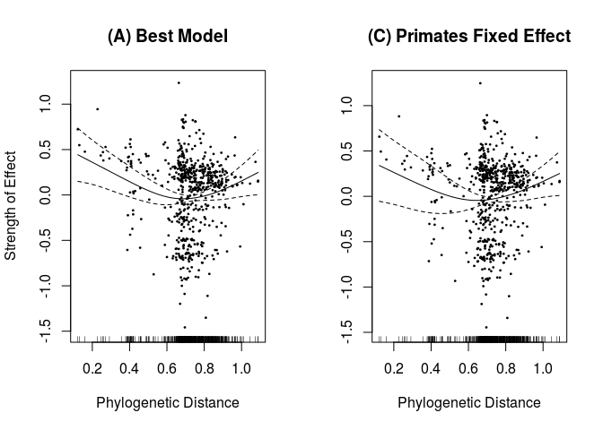
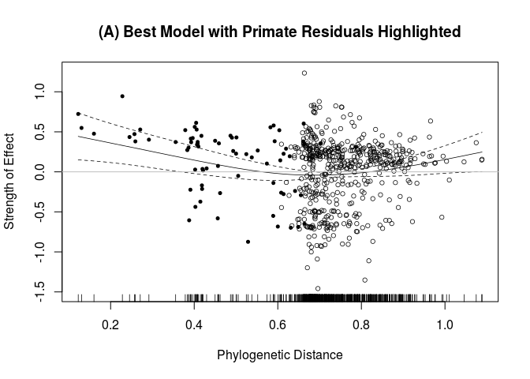

# Phylogenetic Distance / Primates

#### Reviewer Comments:

The result on phylogenetic distance to humans (Fig 2g) is presented as a central finding, but still raises issues. First, it is described as approximating ‘an exponential decay to an asymptote, with some upward drift for very phylogenetically distant mammals’ (line 129-130). This is not accurate – the curve appears roughly parabolic, with a minimum that appears to come before the bulk of the data. Thus the curve is rising through most of the data points. The text attributes this rise either to oversampling of marsupials (which clearly can’t explain the broad pattern) or to the idea that distantly related species pose a uniquely high risk for zoonoses. The latter argument is interesting, but breaks down if extended further to reptiles or insects or plants.

The authors have still not dispelled my previous critique that the meaningful pattern in this relationship (i.e. the downward slope for phylogenetic distance <0.5) is entirely due to non-human primates. Their response
argues that the order Primates did not show an effect in this model (not shown in the ms, but I’ll take their word for it) and therefore the influence of phylogeny is ‘robust across all data, and not necessarily driven by primates alone’. To be convinced of this, I would like to see a partial effect plot from a model with the order Primates included, with a credible interpretation of whatever phylogenetic pattern remains. Until then I don’t find the broad conclusions about the ‘strong predictive power of phylogenetic relatedness’ (line 134) to be supported, beyond apes > monkeys > other mammals. 

#### Response:
Below are partial effect plots comparing the effect of *Phylogenetic Distance from Humans* in the authors' original model (A), a model that includes *Order Primates* as a random effect (B), and a model that includes *Order Primates* as a fixed effect (C).

The graphs below illustrate the minimal effect of including the *Order Primates* variable as a random effect; the *Order Primates* effect is heavily penalized in our GAM after applying shrinkage for model selection purposes, its EDF is ~ 0.0001. Thus, the models are equivalent - this is why the effect is removed in our best model. This is reflected in identical AIC for (A): 1517.584 and (B): 1517.584.

<!-- -->

The following comparison shows that when the *Order Primates* variable is included in the model as a _fixed effect_ (C). In this case, shrinkage is not applied. There is a slight decrease in the effect of *Phylogenetic Distance from Humans* in the lower value range (highlighted); however, the overall phylogenetic pattern remains as previously reported. The coefficient for *Order Primates* as a fixed effect is 0.096, but non-significant (p = 0.513613).  To put this in perspective, the partial effect of *Order Chiroptera* (considered as a random effect, with shrinkage) in the best model is 0.116 and significant. Importantly, coercing *Order Primates* into the model negatively affects the overall fit of model (C), with an AIC of 1519.172 compared to 1517.584 for the best model (A).

<!-- -->

However, while explicitly including the primate order in the model, the effect of phylogenetic distance is still a heavily primate-driven phenomenon, as the
reviewer suggests.  We illustrate this below by showing the partial effect plot for phylogenetic distance, this time coloring the partial residual points for primates in black, while others are white:

<!-- -->

Primates make up all the points below 0.6, the region where the effect phylogenetic distance has a negative relationship with the number of zoonoses found in 
a species.  Thus,  this is a primate-driven effect, but the fact that phylogenetic distance remains in the model while the primates category does not indicates that differences *within* the Primates order are important.  The positive slope for the area below 0.6, we note, largely contains the zero line,
indicating that it alone is just barely significant, and the within-primate pattern drives the majority of this effect.  The difference in strength of effect
on the left and right side is the reason we chose the phrase "an exponential decay to an asymptote, with some upward drift for very phylogenetically distant mammals" which we reword to clarify in the manuscript.
