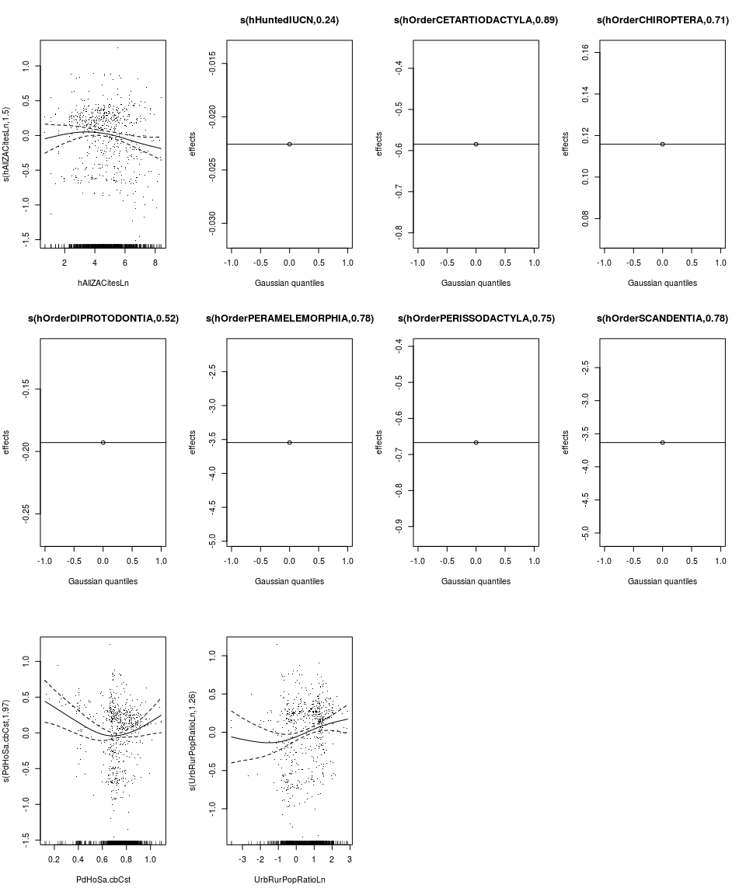
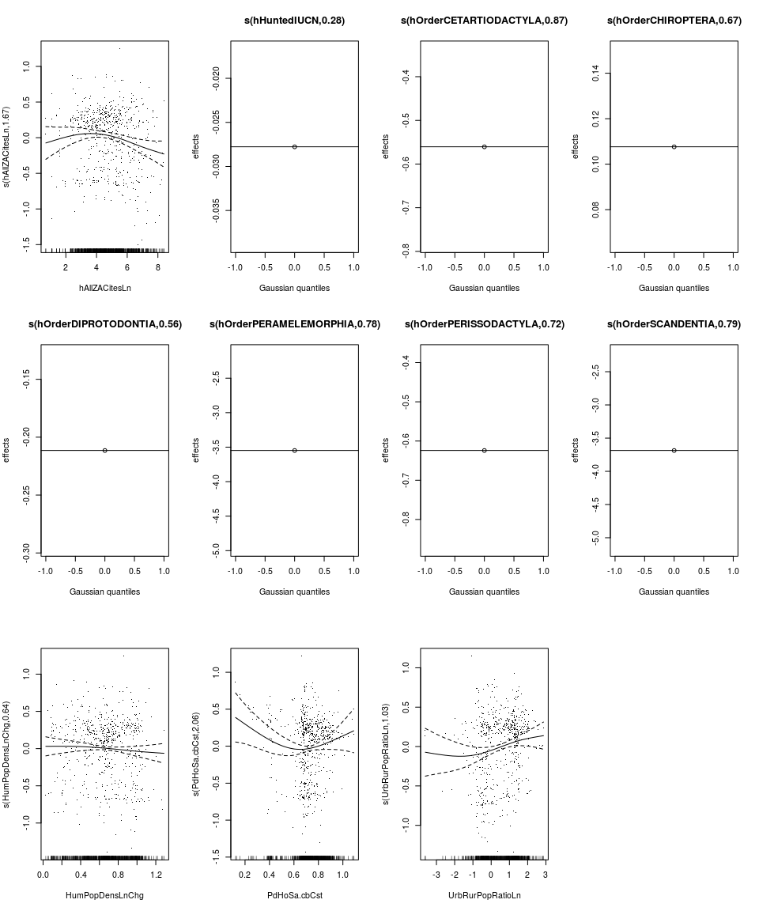
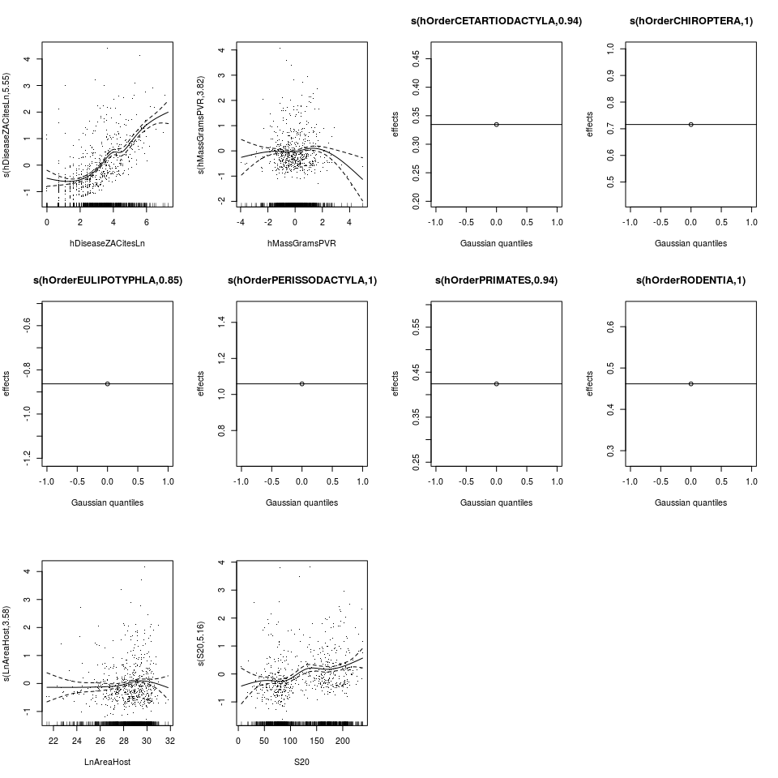
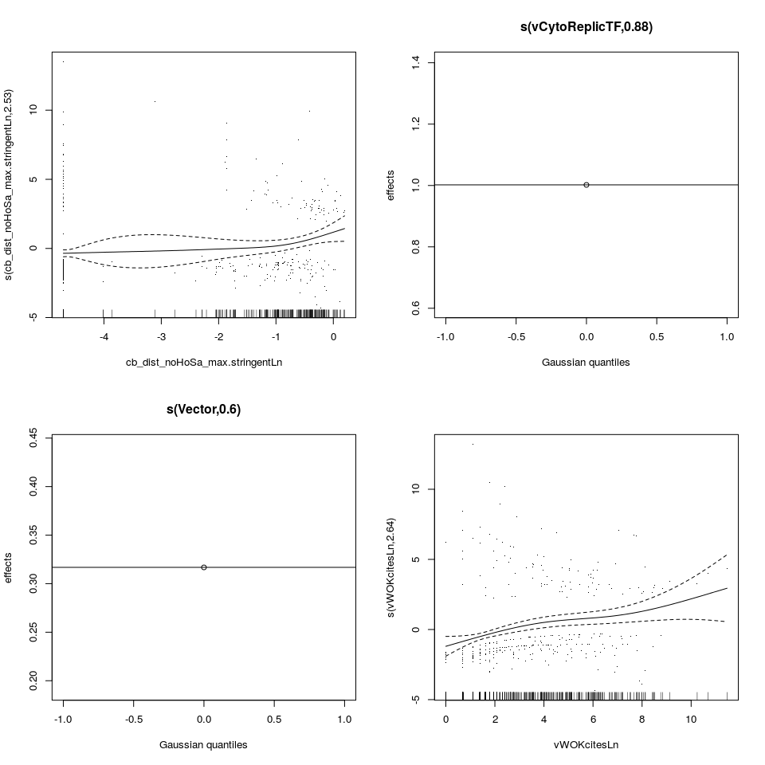
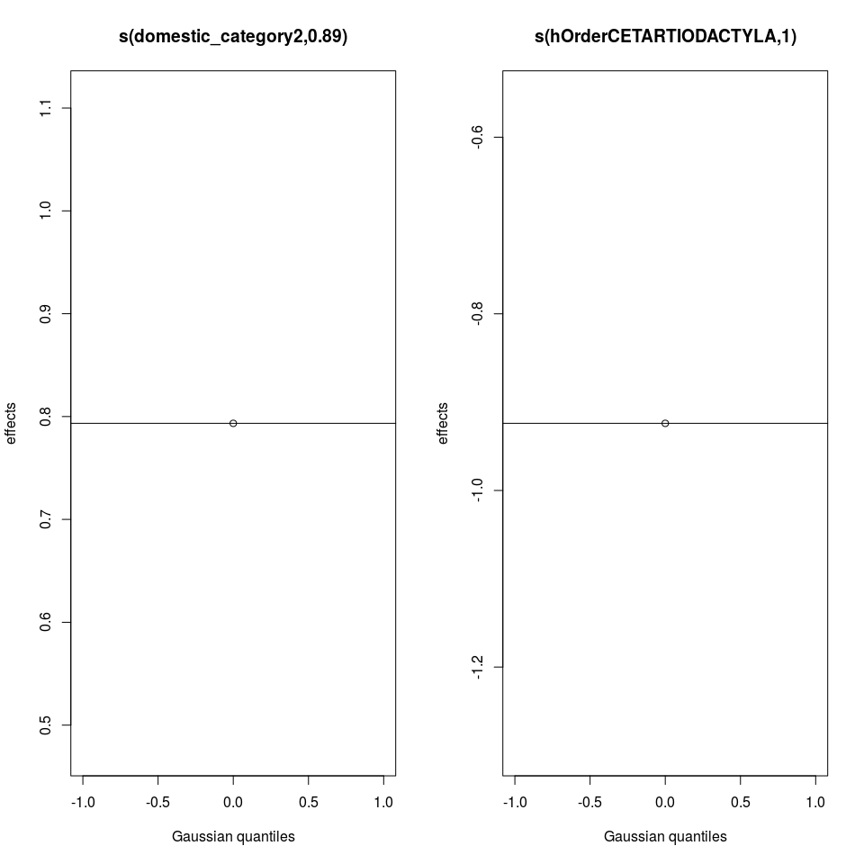
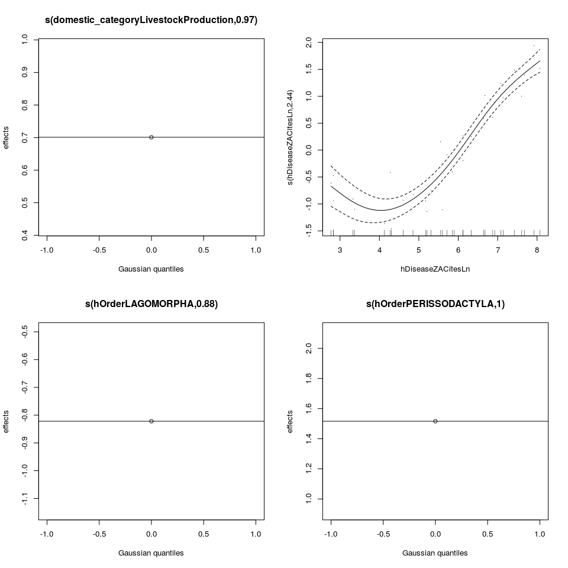
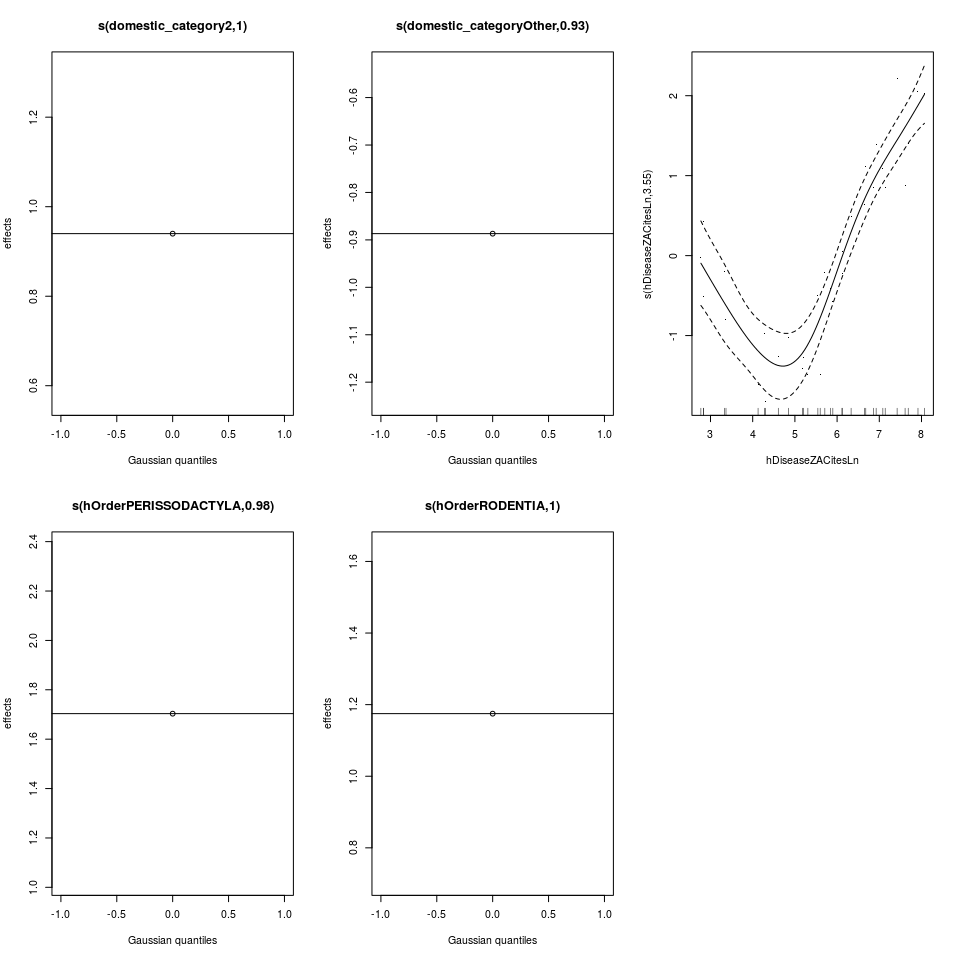

# Supplementary Information: GAM Models


# Zoonoses GAM - All Associations


Terms in models with ΔAIC < 2.  All continuous terms effects are represented
as splines, all discrete terms as random effects:


     ΔAIC  Terms in Model                                                                                                                                                                                                                           
---------  -----------------------------------------------------------------------------------------------------------------------------------------------------------------------------------------------------------------------------------------
 0.000000  offset(LnTotNumVirus) + hAllZACitesLn + hHuntedIUCN + hOrderCETARTIODACTYLA + hOrderCHIROPTERA + hOrderDIPROTODONTIA + hOrderPERAMELEMORPHIA + hOrderPERISSODACTYLA + hOrderSCANDENTIA + PdHoSa.cbCst + UrbRurPopRatioLn                 
 0.051505  offset(LnTotNumVirus) + hAllZACitesLn + hHuntedIUCN + hOrderCETARTIODACTYLA + hOrderCHIROPTERA + hOrderDIPROTODONTIA + hOrderPERAMELEMORPHIA + hOrderPERISSODACTYLA + hOrderSCANDENTIA + HumPopDensLnChg + PdHoSaSTPD + UrbRurPopRatioLn 
 1.262928  offset(LnTotNumVirus) + hDiseaseZACitesLn + hHuntedIUCN + hOrderCETARTIODACTYLA + hOrderCHIROPTERA + hOrderDIPROTODONTIA + hOrderPERAMELEMORPHIA + hOrderPERISSODACTYLA + hOrderSCANDENTIA + PdHoSa.cbCst + UrbRurPopRatioLn             

Partial effect plots of all terms in top model:

<!-- -->

Summary of top model:


```
## 
## Family: poisson 
## Link function: log 
## 
## Formula:
## NSharedWithHoSa ~ s(hAllZACitesLn, bs = "tp", k = 7) + s(hHuntedIUCN, 
##     bs = "re") + s(hOrderCETARTIODACTYLA, bs = "re") + s(hOrderCHIROPTERA, 
##     bs = "re") + s(hOrderDIPROTODONTIA, bs = "re") + s(hOrderPERAMELEMORPHIA, 
##     bs = "re") + s(hOrderPERISSODACTYLA, bs = "re") + s(hOrderSCANDENTIA, 
##     bs = "re") + s(PdHoSa.cbCst, bs = "tp", k = 7) + s(UrbRurPopRatioLn, 
##     bs = "tp", k = 7) + offset(LnTotNumVirus)
## 
## Parametric coefficients:
##             Estimate Std. Error z value Pr(>|z|)    
## (Intercept) -0.34078    0.03976  -8.572   <2e-16 ***
## ---
## Signif. codes:  0 '***' 0.001 '**' 0.01 '*' 0.05 '.' 0.1 ' ' 1
## 
## Approximate significance of smooth terms:
##                             edf Ref.df Chi.sq  p-value    
## s(hAllZACitesLn)         1.4994      6  7.458 0.009885 ** 
## s(hHuntedIUCN)           0.2423      1  0.415 0.202430    
## s(hOrderCETARTIODACTYLA) 0.8896      1 26.998 8.91e-08 ***
## s(hOrderCHIROPTERA)      0.7121      1  4.446 0.016082 *  
## s(hOrderDIPROTODONTIA)   0.5222      1  1.001 0.166705    
## s(hOrderPERAMELEMORPHIA) 0.7799      1  0.760 0.323662    
## s(hOrderPERISSODACTYLA)  0.7462      1  3.030 0.044351 *  
## s(hOrderSCANDENTIA)      0.7841      1  0.811 0.309212    
## s(PdHoSa.cbCst)          1.9705      6 14.498 0.000673 ***
## s(UrbRurPopRatioLn)      1.2568      6 10.278 0.001822 ** 
## ---
## Signif. codes:  0 '***' 0.001 '**' 0.01 '*' 0.05 '.' 0.1 ' ' 1
## 
## R-sq.(adj) =  0.894   Deviance explained = 33.7%
## UBRE = -0.60157  Scale est. = 1         n = 584
```

Relative fraction of deviance explained by each variable in the top model:


Term                     Relative Deviance Explained
----------------------  ----------------------------
hAllZACitesLn                                  10.6%
hHuntedIUCN                                   0.788%
hOrderCETARTIODACTYLA                          34.7%
hOrderCHIROPTERA                               5.93%
hOrderDIPROTODONTIA                            2.25%
hOrderPERAMELEMORPHIA                          4.59%
hOrderPERISSODACTYLA                           5.58%
hOrderSCANDENTIA                               4.85%
PdHoSa.cbCst                                   18.6%
UrbRurPopRatioLn                               12.2%

10-fold cross-validation.  Good fit indicated by *non*-significant p-values:


Fold    Observations Fit   Obervations Held Out   P-value
-----  -----------------  ---------------------  --------
1                    525                     59     0.873
2                    525                     59     0.735
3                    525                     59     0.280
4                    525                     59     0.236
5                    526                     58     0.604
6                    526                     58     0.068
7                    526                     58     0.078
8                    526                     58     0.146
9                    526                     58     0.377
10                   526                     58     0.443

# Zoonoses GAM - Strict Associations


Terms in models with ΔAIC < 2.  All continuous terms effects are represented
as splines, all discrete terms as random effects:


 ΔAIC  Terms in Model                                                                                                                                                                                                          
-----  ------------------------------------------------------------------------------------------------------------------------------------------------------------------------------------------------------------------------
    0  offset(LnTotNumVirus) + hDiseaseZACitesLn + hMassGramsPVR + hOrderCETARTIODACTYLA + hOrderDIPROTODONTIA + hOrderLAGOMORPHA + hOrderPERISSODACTYLA + hOrderPRIMATES + HumPopDensLnChg + PdHoSa.cbCst + UrbRurPopRatioChg 

Partial effect plots of all terms in top model:

<!-- -->

Summary of top model:


```
## 
## Family: poisson 
## Link function: log 
## 
## Formula:
## NSharedWithHoSa_strict ~ s(hDiseaseZACitesLn, bs = "tp", k = 7) + 
##     s(hMassGramsPVR, bs = "tp", k = 7) + s(hOrderCETARTIODACTYLA, 
##     bs = "re") + s(hOrderDIPROTODONTIA, bs = "re") + s(hOrderLAGOMORPHA, 
##     bs = "re") + s(hOrderPERISSODACTYLA, bs = "re") + s(hOrderPRIMATES, 
##     bs = "re") + s(HumPopDensLnChg, bs = "tp", k = 7) + s(PdHoSa.cbCst, 
##     bs = "tp", k = 7) + s(UrbRurPopRatioChg, bs = "tp", k = 7) + 
##     offset(LnTotNumVirus)
## 
## Parametric coefficients:
##             Estimate Std. Error z value Pr(>|z|)    
## (Intercept) -1.34951    0.05957  -22.66   <2e-16 ***
## ---
## Signif. codes:  0 '***' 0.001 '**' 0.01 '*' 0.05 '.' 0.1 ' ' 1
## 
## Approximate significance of smooth terms:
##                             edf Ref.df Chi.sq  p-value    
## s(hDiseaseZACitesLn)     1.2094      6  5.034  0.01426 *  
## s(hMassGramsPVR)         0.1155      6  0.122  0.29403    
## s(hOrderCETARTIODACTYLA) 0.9429      1 22.929 7.48e-07 ***
## s(hOrderDIPROTODONTIA)   0.7079      1  2.388  0.06601 .  
## s(hOrderLAGOMORPHA)      0.4215      1  0.704  0.19560    
## s(hOrderPERISSODACTYLA)  0.8255      1  0.859  0.30760    
## s(hOrderPRIMATES)        0.2845      1  0.621  0.09683 .  
## s(HumPopDensLnChg)       1.4738      6  3.164  0.13164    
## s(PdHoSa.cbCst)          2.3586      6 56.125 8.67e-06 ***
## s(UrbRurPopRatioChg)     4.0467      6 16.880  0.00208 ** 
## ---
## Signif. codes:  0 '***' 0.001 '**' 0.01 '*' 0.05 '.' 0.1 ' ' 1
## 
## R-sq.(adj) =  0.654   Deviance explained = 23.6%
## UBRE = -0.15735  Scale est. = 1         n = 576
```

Relative fraction of deviance explained by each variable in the top model:


Term                     Relative Deviance Explained
----------------------  ----------------------------
hDiseaseZACitesLn                              3.82%
hMassGramsPVR                                   1.1%
hOrderCETARTIODACTYLA                            28%
hOrderDIPROTODONTIA                            2.75%
hOrderLAGOMORPHA                              0.876%
hOrderPERISSODACTYLA                           5.01%
hOrderPRIMATES                                0.103%
HumPopDensLnChg                                 4.3%
PdHoSa.cbCst                                   34.5%
UrbRurPopRatioChg                              19.5%

10-fold cross-validation.  Good fit indicated by *non*-significant p-values:


Fold    Observations Fit   Obervations Held Out   P-value
-----  -----------------  ---------------------  --------
1                    518                     58     0.049
2                    518                     58     0.018
3                    518                     58     0.084
4                    518                     58     0.866
5                    518                     58     0.709
6                    518                     58     0.158
7                    519                     57     0.418
8                    519                     57     0.580
9                    519                     57     0.964
10                   519                     57     0.550

# Zoonoses GAM - All Associations without Reverse Zoonoses


Terms in models with ΔAIC < 2.  All continuous terms effects are represented
as splines, all discrete terms as random effects:


     ΔAIC  Terms in Model                                                                                                                                                                                                                             
---------  -------------------------------------------------------------------------------------------------------------------------------------------------------------------------------------------------------------------------------------------
 0.000000  offset(LnTotNumVirus) + hAllZACitesLn + hHuntedIUCN + hOrderCETARTIODACTYLA + hOrderCHIROPTERA + hOrderDIPROTODONTIA + hOrderPERAMELEMORPHIA + hOrderPERISSODACTYLA + hOrderSCANDENTIA + HumPopDensLnChg + PdHoSa.cbCst + UrbRurPopRatioLn 
 1.486322  offset(LnTotNumVirus) + hAllZACitesLn + hHuntedIUCN + hOrderCETARTIODACTYLA + hOrderCHIROPTERA + hOrderDIPROTODONTIA + hOrderPERAMELEMORPHIA + hOrderPERISSODACTYLA + hOrderSCANDENTIA + HumPopDensLnChg + PdHoSaSTPD + UrbRurPopRatioLn   

Partial effect plots of all terms in top model:

<!-- -->

Summary of top model:


```
## 
## Family: poisson 
## Link function: log 
## 
## Formula:
## NSharedWithHoSa_norev ~ s(hAllZACitesLn, bs = "tp", k = 7) + 
##     s(hHuntedIUCN, bs = "re") + s(hOrderCETARTIODACTYLA, bs = "re") + 
##     s(hOrderCHIROPTERA, bs = "re") + s(hOrderDIPROTODONTIA, bs = "re") + 
##     s(hOrderPERAMELEMORPHIA, bs = "re") + s(hOrderPERISSODACTYLA, 
##     bs = "re") + s(hOrderSCANDENTIA, bs = "re") + s(HumPopDensLnChg, 
##     bs = "tp", k = 7) + s(PdHoSa.cbCst, bs = "tp", k = 7) + s(UrbRurPopRatioLn, 
##     bs = "tp", k = 7) + offset(LnTotNumVirus)
## 
## Parametric coefficients:
##             Estimate Std. Error z value Pr(>|z|)    
## (Intercept) -0.34696    0.03983  -8.711   <2e-16 ***
## ---
## Signif. codes:  0 '***' 0.001 '**' 0.01 '*' 0.05 '.' 0.1 ' ' 1
## 
## Approximate significance of smooth terms:
##                             edf Ref.df Chi.sq  p-value    
## s(hAllZACitesLn)         1.6689      6  8.980  0.00481 ** 
## s(hHuntedIUCN)           0.2775      1  0.537  0.17674    
## s(hOrderCETARTIODACTYLA) 0.8738      1 25.214 1.64e-07 ***
## s(hOrderCHIROPTERA)      0.6705      1  3.940  0.01852 *  
## s(hOrderDIPROTODONTIA)   0.5605      1  1.108  0.16020    
## s(hOrderPERAMELEMORPHIA) 0.7801      1  0.755  0.32514    
## s(hOrderPERISSODACTYLA)  0.7233      1  2.773  0.05058 .  
## s(hOrderSCANDENTIA)      0.7866      1  0.805  0.31186    
## s(HumPopDensLnChg)       0.6403      6  1.182  0.15112    
## s(PdHoSa.cbCst)          2.0565      6 10.147  0.00608 ** 
## s(UrbRurPopRatioLn)      1.0286      6  6.819  0.00402 ** 
## ---
## Signif. codes:  0 '***' 0.001 '**' 0.01 '*' 0.05 '.' 0.1 ' ' 1
## 
## R-sq.(adj) =  0.883   Deviance explained = 32.3%
## UBRE = -0.57891  Scale est. = 1         n = 583
```

Relative fraction of deviance explained by each variable in the top model:


Term                     Relative Deviance Explained
----------------------  ----------------------------
hAllZACitesLn                                  14.9%
hHuntedIUCN                                   0.813%
hOrderCETARTIODACTYLA                          31.9%
hOrderCHIROPTERA                               5.25%
hOrderDIPROTODONTIA                            2.67%
hOrderPERAMELEMORPHIA                          4.95%
hOrderPERISSODACTYLA                           5.17%
hOrderSCANDENTIA                               5.34%
HumPopDensLnChg                                3.55%
PdHoSa.cbCst                                   18.4%
UrbRurPopRatioLn                               7.09%

10-fold cross-validation.  Good fit indicated by *non*-significant p-values:


Fold    Observations Fit   Obervations Held Out   P-value
-----  -----------------  ---------------------  --------
1                    524                     59     0.167
2                    524                     59     0.146
3                    524                     59     0.468
4                    525                     58     0.950
5                    525                     58     0.716
6                    525                     58     0.240
7                    525                     58     0.267
8                    525                     58     0.765
9                    525                     58     0.799
10                   525                     58     0.278

# All Viruses GAM - All Associations


Terms in models with ΔAIC < 2.  All continuous terms effects are represented
as splines, all discrete terms as random effects:


 ΔAIC  Terms in Model                                                                                                                                                                
-----  ------------------------------------------------------------------------------------------------------------------------------------------------------------------------------
    0  hDiseaseZACitesLn + hMassGramsPVR + hOrderCETARTIODACTYLA + hOrderCHIROPTERA + hOrderEULIPOTYPHLA + hOrderPERISSODACTYLA + hOrderPRIMATES + hOrderRODENTIA + LnAreaHost + S20 

Partial effect plots of all terms in top model:

<!-- -->


Summary of top model:


```
## 
## Family: poisson 
## Link function: log 
## 
## Formula:
## TotVirusPerHost ~ s(hDiseaseZACitesLn, bs = "cs", k = 7) + s(hMassGramsPVR, 
##     bs = "cs", k = 7) + s(hOrderCETARTIODACTYLA, bs = "re") + 
##     s(hOrderCHIROPTERA, bs = "re") + s(hOrderEULIPOTYPHLA, bs = "re") + 
##     s(hOrderPERISSODACTYLA, bs = "re") + s(hOrderPRIMATES, bs = "re") + 
##     s(hOrderRODENTIA, bs = "re") + s(LnAreaHost, bs = "cs", k = 7) + 
##     s(S20, bs = "cs", k = 7)
## 
## Parametric coefficients:
##             Estimate Std. Error z value Pr(>|z|)    
## (Intercept)  0.51806    0.06972   7.431 1.08e-13 ***
## ---
## Signif. codes:  0 '***' 0.001 '**' 0.01 '*' 0.05 '.' 0.1 ' ' 1
## 
## Approximate significance of smooth terms:
##                             edf Ref.df   Chi.sq  p-value    
## s(hDiseaseZACitesLn)     5.5484      6 1846.572  < 2e-16 ***
## s(hMassGramsPVR)         3.8207      6  216.421 0.008539 ** 
## s(hOrderCETARTIODACTYLA) 0.9355      1   24.370 0.000231 ***
## s(hOrderCHIROPTERA)      1.0000      1  155.124 2.49e-16 ***
## s(hOrderEULIPOTYPHLA)    0.8482      1    5.867 0.008946 ** 
## s(hOrderPERISSODACTYLA)  0.9999      1    9.949 0.001317 ** 
## s(hOrderPRIMATES)        0.9427      1   34.403 1.52e-05 ***
## s(hOrderRODENTIA)        0.9954      1   95.491 8.53e-09 ***
## s(LnAreaHost)            3.5806      6   18.930 0.024928 *  
## s(S20)                   5.1611      6  301.384 7.25e-15 ***
## ---
## Signif. codes:  0 '***' 0.001 '**' 0.01 '*' 0.05 '.' 0.1 ' ' 1
## 
## R-sq.(adj) =  0.494   Deviance explained = 49.3%
## UBRE = 0.36401  Scale est. = 1         n = 576
```

Relative fraction of deviance explained by each variable in the top model:


Term                     Relative Deviance Explained
----------------------  ----------------------------
hDiseaseZACitesLn                              64.9%
hMassGramsPVR                                   1.9%
hOrderCETARTIODACTYLA                          1.84%
hOrderCHIROPTERA                               9.92%
hOrderEULIPOTYPHLA                             1.08%
hOrderPERISSODACTYLA                           1.41%
hOrderPRIMATES                                 2.51%
hOrderRODENTIA                                  4.8%
LnAreaHost                                      1.6%
S20                                              10%

10-fold cross-validation.  Good fit indicated by *non*-significant p-values:


Fold    Observations Fit   Obervations Held Out   P-value
-----  -----------------  ---------------------  --------
1                    518                     58     0.901
2                    518                     58     0.416
3                    518                     58     0.734
4                    518                     58     0.474
5                    518                     58     0.327
6                    518                     58     0.155
7                    519                     57     0.153
8                    519                     57     0.912
9                    519                     57     0.174
10                   519                     57     0.391

# All Viruses GAM - Strict Associations


Terms in models with ΔAIC < 2.  All continuous terms effects are represented
as splines, all discrete terms as random effects:


 ΔAIC  Terms in Model                                                                                                                                                                              
-----  --------------------------------------------------------------------------------------------------------------------------------------------------------------------------------------------
    0  hDiseaseZACitesLn + hMassGramsPVR + hOrderCHIROPTERA + hOrderCINGULATA + hOrderEULIPOTYPHLA + hOrderPERAMELEMORPHIA + hOrderPRIMATES + hOrderRODENTIA + hOrderSCANDENTIA + LnAreaHost + S20 

Partial effect plots of all terms in top model:

<!-- -->

Summary of top model:


```
## 
## Family: poisson 
## Link function: log 
## 
## Formula:
## TotVirusPerHost_strict ~ s(hDiseaseZACitesLn, bs = "cs", k = 7) + 
##     s(hMassGramsPVR, bs = "cs", k = 7) + s(hOrderCHIROPTERA, 
##     bs = "re") + s(hOrderCINGULATA, bs = "re") + s(hOrderEULIPOTYPHLA, 
##     bs = "re") + s(hOrderPERAMELEMORPHIA, bs = "re") + s(hOrderPRIMATES, 
##     bs = "re") + s(hOrderRODENTIA, bs = "re") + s(hOrderSCANDENTIA, 
##     bs = "re") + s(LnAreaHost, bs = "cs", k = 7) + s(S20, bs = "cs", 
##     k = 7)
## 
## Parametric coefficients:
##             Estimate Std. Error z value Pr(>|z|)    
## (Intercept) -0.46816    0.08818  -5.309  1.1e-07 ***
## ---
## Signif. codes:  0 '***' 0.001 '**' 0.01 '*' 0.05 '.' 0.1 ' ' 1
## 
## Approximate significance of smooth terms:
##                             edf Ref.df  Chi.sq  p-value    
## s(hDiseaseZACitesLn)     4.9779      6 923.024  < 2e-16 ***
## s(hMassGramsPVR)         3.5116      6   9.646 0.035625 *  
## s(hOrderCHIROPTERA)      0.9999      1 109.230 5.11e-14 ***
## s(hOrderCINGULATA)       0.7633      1   0.868 0.286385    
## s(hOrderEULIPOTYPHLA)    0.5887      1   1.210 0.150553    
## s(hOrderPERAMELEMORPHIA) 0.7049      1   0.737 0.306647    
## s(hOrderPRIMATES)        0.9998      1  85.119 4.92e-14 ***
## s(hOrderRODENTIA)        0.9766      1 129.283 8.62e-15 ***
## s(hOrderSCANDENTIA)      0.4108      1   0.941 0.130105    
## s(LnAreaHost)            2.6550      6  11.138 0.078928 .  
## s(S20)                   4.6935      6  44.963 0.000481 ***
## ---
## Signif. codes:  0 '***' 0.001 '**' 0.01 '*' 0.05 '.' 0.1 ' ' 1
## 
## R-sq.(adj) =  0.419   Deviance explained = 35.8%
## UBRE =   0.38  Scale est. = 1         n = 575
```

Relative fraction of deviance explained by each variable in the top model:


Term                     Relative Deviance Explained
----------------------  ----------------------------
hDiseaseZACitesLn                              53.6%
hMassGramsPVR                                  2.76%
hOrderCHIROPTERA                               12.2%
hOrderCINGULATA                               0.563%
hOrderEULIPOTYPHLA                             0.37%
hOrderPERAMELEMORPHIA                         0.362%
hOrderPRIMATES                                 11.8%
hOrderRODENTIA                                 12.6%
hOrderSCANDENTIA                              0.286%
LnAreaHost                                     1.53%
S20                                             3.9%

10-fold cross-validation.  Good fit indicated by *non*-significant p-values:


Fold    Observations Fit   Obervations Held Out   P-value
-----  -----------------  ---------------------  --------
1                    517                     58     0.558
2                    517                     58     0.067
3                    517                     58     0.524
4                    517                     58     0.918
5                    517                     58     0.376
6                    518                     57     0.477
7                    518                     57     0.301
8                    518                     57     0.414
9                    518                     57     0.644
10                   518                     57     0.930

# Viral Traits GAM - All Associations


Terms in models with ΔAIC < 2.  All continuous terms effects are represented
as splines, all discrete terms as random effects:


 ΔAIC  Terms in Model                                                                              
-----  --------------------------------------------------------------------------------------------
    0  cb_dist_noHoSa_maxLn + Envelope + vCytoReplicTF + Vector + vGenomeAveLengthLn + vWOKcitesLn 

Partial effect plots of all terms in top model:

<!-- -->

Summary of top model:


```
## 
## Family: binomial 
## Link function: logit 
## 
## Formula:
## IsZoonotic ~ s(cb_dist_noHoSa_maxLn, bs = "tp", k = 7) + s(Envelope, 
##     bs = "re") + s(vCytoReplicTF, bs = "re") + s(Vector, bs = "re") + 
##     s(vGenomeAveLengthLn, bs = "tp", k = 7) + s(vWOKcitesLn, 
##     bs = "tp", k = 7)
## 
## Parametric coefficients:
##             Estimate Std. Error z value Pr(>|z|)    
## (Intercept)  -1.5864     0.2786  -5.693 1.24e-08 ***
## ---
## Signif. codes:  0 '***' 0.001 '**' 0.01 '*' 0.05 '.' 0.1 ' ' 1
## 
## Approximate significance of smooth terms:
##                             edf Ref.df Chi.sq  p-value    
## s(cb_dist_noHoSa_maxLn) 2.94210      6 44.910 7.48e-10 ***
## s(Envelope)             0.45964      1  0.884 0.166460    
## s(vCytoReplicTF)        0.85868      1 10.956 0.000854 ***
## s(Vector)               0.75131      1  4.901 0.014258 *  
## s(vGenomeAveLengthLn)   0.09239      6  0.117 0.265718    
## s(vWOKcitesLn)          3.28464      6 35.828 3.98e-07 ***
## ---
## Signif. codes:  0 '***' 0.001 '**' 0.01 '*' 0.05 '.' 0.1 ' ' 1
## 
## R-sq.(adj) =  0.313   Deviance explained = 27.2%
## UBRE = 0.002481  Scale est. = 1         n = 464
```

Relative fraction of deviance explained by each variable in the top model:


Term                    Relative Deviance Explained
---------------------  ----------------------------
cb_dist_noHoSa_maxLn                          45.6%
Envelope                                      2.32%
vCytoReplicTF                                 9.15%
Vector                                        4.61%
vGenomeAveLengthLn                           0.946%
vWOKcitesLn                                   37.4%

10-fold cross-validation.  Good fit indicated by *non*-significant p-values:


Fold    Observations Fit   Obervations Held Out   P-value
-----  -----------------  ---------------------  --------
1                    417                     47     0.420
2                    417                     47     0.718
3                    417                     47     0.709
4                    417                     47     0.876
5                    418                     46     0.715
6                    418                     46     0.143
7                    418                     46     0.383
8                    418                     46     0.233
9                    418                     46     0.852
10                   418                     46     0.347


# Viral Traits GAM - Strict Associations


Terms in models with ΔAIC < 2.  All continuous terms effects are represented
as splines, all discrete terms as random effects:


     ΔAIC  Terms in Model                                                           
---------  -------------------------------------------------------------------------
 0.000000  cb_dist_noHoSa_max.stringentLn + vCytoReplicTF + Vector + vWOKcitesLn    
 1.715608  cb_dist_noHoSa_mean.stringentLn + vCytoReplicTF + Vector + vWOKcitesLn   
 1.742713  cb_dist_noHoSa_median.stringentLn + vCytoReplicTF + Vector + vWOKcitesLn 

Partial effect plots of all terms in top model:

<!-- -->

Summary of top model:


```
## 
## Family: binomial 
## Link function: logit 
## 
## Formula:
## IsZoonotic.stringent ~ s(cb_dist_noHoSa_max.stringentLn, bs = "tp", 
##     k = 7) + s(vCytoReplicTF, bs = "re") + s(Vector, bs = "re") + 
##     s(vWOKcitesLn, bs = "tp", k = 7)
## 
## Parametric coefficients:
##             Estimate Std. Error z value Pr(>|z|)    
## (Intercept)  -2.2312     0.2969  -7.514 5.72e-14 ***
## ---
## Signif. codes:  0 '***' 0.001 '**' 0.01 '*' 0.05 '.' 0.1 ' ' 1
## 
## Approximate significance of smooth terms:
##                                      edf Ref.df Chi.sq  p-value    
## s(cb_dist_noHoSa_max.stringentLn) 2.5254      6 15.750 0.000556 ***
## s(vCytoReplicTF)                  0.8781      1 10.328 0.001101 ** 
## s(Vector)                         0.6035      1  1.873 0.085405 .  
## s(vWOKcitesLn)                    2.6374      6 29.513  4.3e-07 ***
## ---
## Signif. codes:  0 '***' 0.001 '**' 0.01 '*' 0.05 '.' 0.1 ' ' 1
## 
## R-sq.(adj) =  0.225   Deviance explained = 21.1%
## UBRE = -0.092089  Scale est. = 1         n = 408
```

Relative fraction of deviance explained by each variable in the top model:


Term                              Relative Deviance Explained
-------------------------------  ----------------------------
cb_dist_noHoSa_max.stringentLn                          25.5%
vCytoReplicTF                                           17.5%
Vector                                                  3.88%
vWOKcitesLn                                             53.1%

10-fold cross-validation.  Good fit indicated by *non*-significant p-values:


Fold    Observations Fit   Obervations Held Out   P-value
-----  -----------------  ---------------------  --------
1                    367                     41     0.621
2                    367                     41     0.439
3                    367                     41     0.013
4                    367                     41     0.301
5                    367                     41     0.424
6                    367                     41     0.852
7                    367                     41     0.824
8                    367                     41     0.532
9                    368                     40     0.544
10                   368                     40     0.425

# Zoonoses in Domestic Animals GAM - All Associations


Terms in models with ΔAIC < 2.  All continuous terms effects are represented
as splines, all discrete terms as random effects:


      ΔAIC  Terms in Model                                                                                          
----------  --------------------------------------------------------------------------------------------------------
 0.0000000  offset(LnTotNumVirus) + domestic_categoryLivestockProduction + hOrderCETARTIODACTYLA                    
 0.0413592  offset(LnTotNumVirus) + domestic_categoryLivestockProduction + hOrderCETARTIODACTYLA + hOrderLAGOMORPHA 

Partial effect plots of all terms in top model:

<!-- -->

Summary of top model:


```
## 
## Family: poisson 
## Link function: log 
## 
## Formula:
## NSharedWithHoSa ~ s(domestic_categoryLivestockProduction, bs = "re") + 
##     s(hOrderCETARTIODACTYLA, bs = "re") + offset(LnTotNumVirus)
## 
## Parametric coefficients:
##             Estimate Std. Error z value Pr(>|z|)    
## (Intercept) -0.60693    0.09325  -6.509 7.58e-11 ***
## ---
## Signif. codes:  0 '***' 0.001 '**' 0.01 '*' 0.05 '.' 0.1 ' ' 1
## 
## Approximate significance of smooth terms:
##                                            edf Ref.df Chi.sq p-value   
## s(domestic_categoryLivestockProduction) 0.8861      1  68.07 0.00439 **
## s(hOrderCETARTIODACTYLA)                0.9999      1  97.22 0.00205 **
## ---
## Signif. codes:  0 '***' 0.001 '**' 0.01 '*' 0.05 '.' 0.1 ' ' 1
## 
## R-sq.(adj) =   0.96   Deviance explained =   38%
## UBRE = -0.17089  Scale est. = 1         n = 32
```

Relative fraction of deviance explained by each variable in the top model:


Term                                    Relative Deviance Explained
-------------------------------------  ----------------------------
domestic_categoryLivestockProduction                            43%
hOrderCETARTIODACTYLA                                           57%

10-fold cross-validation.  Good fit indicated by *non*-significant p-values:


Fold    Observations Fit   Obervations Held Out   P-value
-----  -----------------  ---------------------  --------
1                     28                      4     0.000
2                     28                      4     0.750
3                     29                      3     0.748
4                     29                      3     0.248
5                     29                      3     0.000
6                     29                      3     0.750
7                     29                      3     0.497
8                     29                      3     0.501
9                     29                      3     0.251
10                    29                      3     0.000


# Zoonoses in Domestic Animals GAM - Strict Associations


Terms in models with ΔAIC < 2.  All continuous terms effects are represented
as splines, all discrete terms as random effects:


      ΔAIC  Terms in Model                                                                                                                                
----------  ----------------------------------------------------------------------------------------------------------------------------------------------
 0.0000000  offset(LnTotNumVirus) + hOrderLAGOMORPHA + hOrderPROBOSCIDEA + hOrderRODENTIA                                                                 
 0.0005550  offset(LnTotNumVirus) + hOrderLAGOMORPHA + hOrderPROBOSCIDEA                                                                                  
 0.3074961  offset(LnTotNumVirus) + hOrderLAGOMORPHA + hOrderRODENTIA                                                                                     
 0.3115803  offset(LnTotNumVirus) + hOrderLAGOMORPHA                                                                                                      
 0.6164310  offset(LnTotNumVirus) + hOrderPROBOSCIDEA + hOrderRODENTIA                                                                                    
 0.6978756  offset(LnTotNumVirus) + hOrderPROBOSCIDEA                                                                                                     
 0.7057037  offset(LnTotNumVirus) + domestic_categoryOther + hOrderPROBOSCIDEA                                                                            
 0.8929570  offset(LnTotNumVirus) + domestic_categorySmallExoticFarming + hMassGramsPVR + hOrderRODENTIA + LnDOMYearBP                                    
 0.9226537  offset(LnTotNumVirus) + domestic_categorySmallExoticFarming + hOrderRODENTIA + LnDOMYearBP                                                    
 1.0015364  offset(LnTotNumVirus) + hOrderRODENTIA                                                                                                        
 1.0422320  offset(LnTotNumVirus) + domestic_categorySmallExoticFarming + hMassGramsPVR + hOrderRODENTIA + LnDOMYearBP + PdHoSa.cbCst                     
 1.0604040  offset(LnTotNumVirus) + domestic_categorySmallExoticFarming + hOrderLAGOMORPHA + hOrderRODENTIA + LnDOMYearBP                                 
 1.0695974  offset(LnTotNumVirus) + domestic_categorySmallExoticFarming + hOrderLAGOMORPHA + hOrderPROBOSCIDEA + hOrderRODENTIA + LnDOMYearBP             
 1.0738794  offset(LnTotNumVirus)                                                                                                                         
 1.0738794  +offset(LnTotNumVirus)                                                                                                                        
 1.0741740  offset(LnTotNumVirus) + domestic_categoryOther                                                                                                
 1.1158737  offset(LnTotNumVirus) + domestic_categorySmallExoticFarming + hOrderRODENTIA + LnDOMYearBP + PdHoSa.cbCst                                     
 1.1850913  offset(LnTotNumVirus) + domestic_categorySmallExoticFarming + hMassGramsPVR + hOrderLAGOMORPHA + hOrderRODENTIA + LnDOMYearBP                 
 1.5035833  offset(LnTotNumVirus) + domestic_categorySmallExoticFarming + hAllZACitesLn + hOrderRODENTIA + LnDOMYearBP + PdHoSa.cbCst                     
 1.5622911  offset(LnTotNumVirus) + domestic_categorySmallExoticFarming + hDiseaseZACitesLn + hOrderRODENTIA + LnDOMYearBP + PdHoSa.cbCst                 
 1.5691890  offset(LnTotNumVirus) + domestic_categorySmallExoticFarming + hDiseaseZACitesLn + hMassGramsPVR + hOrderRODENTIA + LnDOMYearBP + PdHoSa.cbCst 
 1.8493075  offset(LnTotNumVirus) + domestic_categoryOther + domestic_categorySmallExoticFarming + LnDOMYearBP                                            
 1.8574597  offset(LnTotNumVirus) + domestic_categoryOther + domestic_categorySmallExoticFarming + hOrderLAGOMORPHA + hOrderPROBOSCIDEA + LnDOMYearBP     
 1.8575925  offset(LnTotNumVirus) + domestic_categoryOther + domestic_categorySmallExoticFarming + hOrderLAGOMORPHA + LnDOMYearBP                         
 1.8765366  offset(LnTotNumVirus) + domestic_categorySmallExoticFarming + hAllZACitesLn + hOrderLAGOMORPHA + hOrderRODENTIA + LnDOMYearBP + PdHoSa.cbCst  
 1.9380815  offset(LnTotNumVirus) + domestic_categoryOther + domestic_categorySmallExoticFarming + hMassGramsPVR + LnDOMYearBP                            

Partial effect plots of all terms in top model:

<!-- -->

Summary of top model:


```
## 
## Family: poisson 
## Link function: log 
## 
## Formula:
## NSharedWithHoSa_strict ~ offset(LnTotNumVirus) + s(hOrderLAGOMORPHA, 
##     bs = "re") + s(hOrderPROBOSCIDEA, bs = "re") + s(hOrderRODENTIA, 
##     bs = "re")
## 
## Parametric coefficients:
##             Estimate Std. Error z value Pr(>|z|)    
## (Intercept)  -1.8331     0.1126  -16.27   <2e-16 ***
## ---
## Signif. codes:  0 '***' 0.001 '**' 0.01 '*' 0.05 '.' 0.1 ' ' 1
## 
## Approximate significance of smooth terms:
##                         edf Ref.df Chi.sq p-value
## s(hOrderLAGOMORPHA)  0.7495      1  0.766   0.312
## s(hOrderPROBOSCIDEA) 0.3688      1  0.759   0.152
## s(hOrderRODENTIA)    0.2521      1  0.343   0.243
## 
## R-sq.(adj) =  0.907   Deviance explained = 12.6%
## UBRE = 0.065353  Scale est. = 1         n = 32
```

Relative fraction of deviance explained by each variable in the top model:


Term                 Relative Deviance Explained
------------------  ----------------------------
hOrderLAGOMORPHA                           56.8%
hOrderPROBOSCIDEA                          28.8%
hOrderRODENTIA                             14.5%

10-fold cross-validation.  Good fit indicated by *non*-significant p-values:


Fold    Observations Fit   Obervations Held Out   P-value
-----  -----------------  ---------------------  --------
1                     28                      4     0.874
2                     28                      4     0.499
3                     29                      3     0.502
4                     29                      3     0.000
5                     29                      3     0.252
6                     29                      3     0.249
7                     29                      3     0.252
8                     29                      3     0.748
9                     29                      3     0.247
10                    29                      3     0.500

# All Viruses in Domestic Animals GAM - All Associations


Terms in models with ΔAIC < 2.  All continuous terms effects are represented
as splines, all discrete terms as random effects:


      ΔAIC  Terms in Model                                                                                                                             
----------  -------------------------------------------------------------------------------------------------------------------------------------------
 0.0000000  domestic_categoryLivestockProduction + hDiseaseZACitesLn + hOrderLAGOMORPHA + hOrderPERISSODACTYLA                                         
 0.6208198  domestic_categoryLivestockProduction + hDiseaseZACitesLn + hMassGramsPVR + hOrderLAGOMORPHA + hOrderPERISSODACTYLA                         
 1.1453821  domestic_categoryLivestockProduction + hDiseaseZACitesLn + hMassGramsPVR + hOrderCETARTIODACTYLA + hOrderLAGOMORPHA + hOrderPERISSODACTYLA 

Partial effect plots of all terms in top model:

<!-- -->

Summary of top model:


```
## 
## Family: poisson 
## Link function: log 
## 
## Formula:
## TotVirusPerHost ~ s(domestic_categoryLivestockProduction, bs = "re") + 
##     s(hDiseaseZACitesLn, bs = "tp", k = 7) + s(hOrderLAGOMORPHA, 
##     bs = "re") + s(hOrderPERISSODACTYLA, bs = "re")
## 
## Parametric coefficients:
##             Estimate Std. Error z value Pr(>|z|)    
## (Intercept)  1.95532    0.08373   23.35   <2e-16 ***
## ---
## Signif. codes:  0 '***' 0.001 '**' 0.01 '*' 0.05 '.' 0.1 ' ' 1
## 
## Approximate significance of smooth terms:
##                                            edf Ref.df   Chi.sq  p-value
## s(domestic_categoryLivestockProduction) 0.9656      1   82.572 2.72e-13
## s(hDiseaseZACitesLn)                    2.4410      6 8060.305  < 2e-16
## s(hOrderLAGOMORPHA)                     0.8752      1    6.812  0.00636
## s(hOrderPERISSODACTYLA)                 0.9999      1  137.218  < 2e-16
##                                            
## s(domestic_categoryLivestockProduction) ***
## s(hDiseaseZACitesLn)                    ***
## s(hOrderLAGOMORPHA)                     ** 
## s(hOrderPERISSODACTYLA)                 ***
## ---
## Signif. codes:  0 '***' 0.001 '**' 0.01 '*' 0.05 '.' 0.1 ' ' 1
## 
## R-sq.(adj) =  0.953   Deviance explained = 94.2%
## UBRE = 0.47854  Scale est. = 1         n = 32
```

Relative fraction of deviance explained by each variable in the top model:


Term                                    Relative Deviance Explained
-------------------------------------  ----------------------------
domestic_categoryLivestockProduction                          9.98%
hDiseaseZACitesLn                                             72.4%
hOrderLAGOMORPHA                                              1.61%
hOrderPERISSODACTYLA                                            16%

10-fold cross-validation.  Good fit indicated by *non*-significant p-values:


Fold    Observations Fit   Obervations Held Out   P-value
-----  -----------------  ---------------------  --------
1                     28                      4     0.875
2                     28                      4     0.504
3                     29                      3     0.501
4                     29                      3     0.498
5                     29                      3     0.749
6                     29                      3     0.000
7                     29                      3     0.499
8                     29                      3     0.000
9                     29                      3     0.750
10                    29                      3     0.000

# All Viruses in Domestic Animals GAM - Stringent Associations


Terms in models with ΔAIC < 2.  All continuous terms effects are represented
as splines, all discrete terms as random effects:


      ΔAIC  Terms in Model                                                                                                                               
----------  ---------------------------------------------------------------------------------------------------------------------------------------------
 0.0000000  domestic_categoryLivestockProduction + domestic_categoryOther + hDiseaseZACitesLn + hOrderPERISSODACTYLA + hOrderRODENTIA                    
 0.0555192  domestic_categoryLivestockProduction + domestic_categoryOther + hDiseaseZACitesLn + hOrderLAGOMORPHA + hOrderPERISSODACTYLA + hOrderRODENTIA 
 1.3747177  domestic_categoryLivestockProduction + hDiseaseZACitesLn + hOrderPERISSODACTYLA + hOrderRODENTIA                                             

Partial effect plots of all terms in top model:

<!-- -->

Summary of top model:


```
## 
## Family: poisson 
## Link function: log 
## 
## Formula:
## TotVirusPerHost_strict ~ s(domestic_categoryLivestockProduction, 
##     bs = "re") + s(domestic_categoryOther, bs = "re") + s(hDiseaseZACitesLn, 
##     bs = "tp", k = 7) + s(hOrderPERISSODACTYLA, bs = "re") + 
##     s(hOrderRODENTIA, bs = "re")
## 
## Parametric coefficients:
##             Estimate Std. Error z value Pr(>|z|)    
## (Intercept)    1.090      0.141   7.731 1.07e-14 ***
## ---
## Signif. codes:  0 '***' 0.001 '**' 0.01 '*' 0.05 '.' 0.1 ' ' 1
## 
## Approximate significance of smooth terms:
##                                            edf Ref.df    Chi.sq  p-value
## s(domestic_categoryLivestockProduction) 1.0000      1 1.106e+02 3.81e-09
## s(domestic_categoryOther)               0.9336      1 2.143e+02 0.016014
## s(hDiseaseZACitesLn)                    3.5543      6 1.210e+06 8.13e-07
## s(hOrderPERISSODACTYLA)                 0.9789      1 8.135e+01 1.57e-15
## s(hOrderRODENTIA)                       1.0000      1 4.275e+02 0.000549
##                                            
## s(domestic_categoryLivestockProduction) ***
## s(domestic_categoryOther)               *  
## s(hDiseaseZACitesLn)                    ***
## s(hOrderPERISSODACTYLA)                 ***
## s(hOrderRODENTIA)                       ***
## ---
## Signif. codes:  0 '***' 0.001 '**' 0.01 '*' 0.05 '.' 0.1 ' ' 1
## 
## R-sq.(adj) =  0.908   Deviance explained = 91.8%
## UBRE = 0.62949  Scale est. = 1         n = 32
```

Relative fraction of deviance explained by each variable in the top model:


Term                                    Relative Deviance Explained
-------------------------------------  ----------------------------
domestic_categoryLivestockProduction                          11.3%
domestic_categoryOther                                        1.85%
hDiseaseZACitesLn                                             68.4%
hOrderPERISSODACTYLA                                            15%
hOrderRODENTIA                                                3.47%

10-fold cross-validation.  Good fit indicated by *non*-significant p-values:


Fold    Observations Fit   Obervations Held Out   P-value
-----  -----------------  ---------------------  --------
1                     28                      4     0.625
2                     28                      4     0.125
3                     29                      3     0.498
4                     29                      3     0.500
5                     29                      3     0.750
6                     29                      3     0.250
7                     29                      3     0.247
8                     29                      3     0.751
9                     29                      3     0.749
10                    29                      3     0.749

<!-- # Publication plots -->


