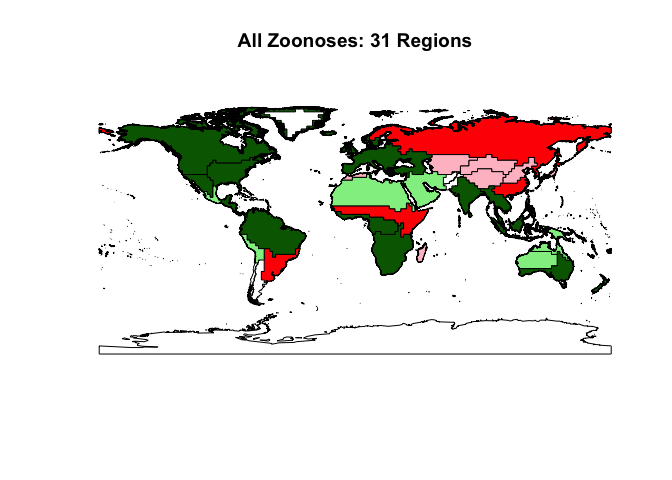
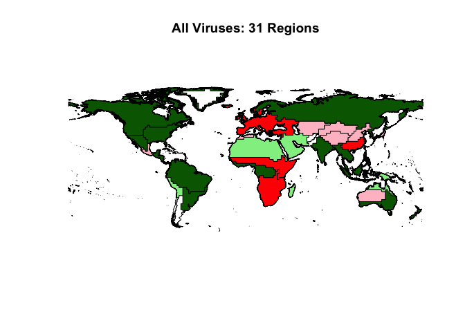
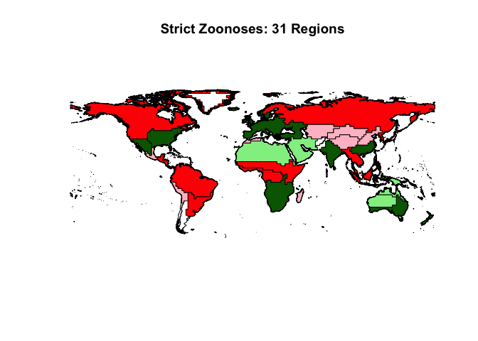
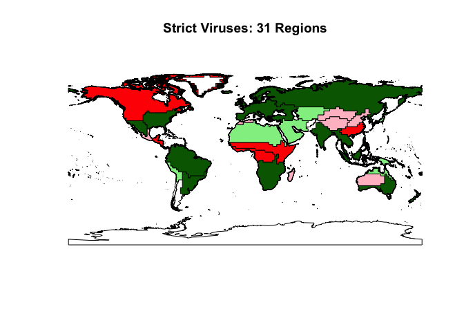

# HP3: Zoogeographical Cross-Validation

# Zoogeographic Cross-Validation

In addition to randomly-selected k-fold cross-validation, we evaluated the robustness of our models via non-random geographic cross-validation: we systematically removed all observations from a zoogeographical region, re-fit the model using all observations from outside the region, then performed a non-parametric permutation test comparing the predicted values to the observed values for that region.

In order to meaningfully organize geographic areas, we utilized mammalian zoogeographic regions from [*Holt et al (2013)*](http://dx.doi.org/10.1126/science.1228282) which are defined by distributions of and phylogenetic relationships between species. Using QGIS, a mammal-specific zoogeographical shapefile provided by [Holt's group](http://macroecology.ku.dk/resources/wallace) at the University of Copenhagen was intersected (using QGIS Vector > Geoprocessing Tools > Intersect) with a shapefile of IUCN's host ranges. Areas of these intersections were then calculated using an equal-area projection, and each host was assigned to only the region which contained the greatest proportion of its range. Results of the non-parametric permutation test are shown below; non-significant results indicate that model predictions are unbiased.

# Zoonoses GAM - All Associations

<!-- -->

Dark green indicates unbiased regions, while dark red indicates regions with evidence of biased predictions. Light green and light red represent the same distinction, but these regions contain very few (less than ten) assigned species; blank areas were not assigned any hosts. 

Table: Biased Predictions Regions (n > 10)

Region                        Observations Fit   Observations Held Out   P-value   Mean Prediction Difference
---------------------------  -----------------  ----------------------  --------  ---------------------------
Southeastern South America                 562                      22    0.0020                       0.2929
Central African Band                       550                      34    0.0120                      -0.4762
Northern Eurussia                          548                      36    0.0131                       0.3392
Southeastern China                         569                      15    0.0000                       0.4007

Table: Unbiased Prediction Regions (n > 10)

Region                             Observations Fit   Observations Held Out   P-value   Mean Prediction Difference
--------------------------------  -----------------  ----------------------  --------  ---------------------------
Northern America                                525                      59    0.9065                      -0.0134
Southwestern North America                      563                      21    0.8565                      -0.0209
Central / Eastern North America                 562                      22    0.1389                       0.2515
Southern Central America                        567                      17    0.5767                       0.1131
Northern South America                          485                      99    0.6268                      -0.0404
West Central Africa                             551                      33    0.2802                       0.0999
Europe                                          546                      38    0.0558                      -0.3289
South Africa                                    523                      61    0.1907                      -0.1695
India                                           563                      21    0.7440                      -0.0991
Southeast Asia                                  550                      34    0.6887                      -0.0746
Southern Australia                              573                      11    0.2839                      -0.2837

# All Viruses GAM - All Associations

<!-- -->

Dark green indicates unbiased regions, while dark red indicates regions with evidence of biased predictions. Light green and light red represent the same distinction, but these regions contain very few (less than ten) assigned species; blank areas were not assigned any hosts. 

Table: Biased Predictions Regions (n > 10)

Region                  Observations Fit   Observations Held Out   P-value   Mean Prediction Difference
---------------------  -----------------  ----------------------  --------  ---------------------------
Central African Band                 542                      34    0.0269                       0.9721
Europe                               539                      37    0.0004                      -1.5026
South Africa                         515                      61    0.0089                       0.8337
Southeastern China                   562                      14    0.0008                      -1.5620

Table: Unbiased Prediction Regions (n > 10)

Region                             Observations Fit   Observations Held Out   P-value   Mean Prediction Difference
--------------------------------  -----------------  ----------------------  --------  ---------------------------
Northern America                                517                      59    0.8147                      -0.0525
Southwestern North America                      555                      21    0.8199                       0.0850
Central / Eastern North America                 554                      22    0.3416                       0.9864
Southern Central America                        560                      16    0.5829                      -0.4242
Northern South America                          477                      99    0.2172                       0.3873
Southeastern South America                      555                      21    0.3828                      -0.2898
West Central Africa                             545                      31    0.7901                       0.0923
India                                           555                      21    0.2178                       1.1181
Northern Eurussia                               540                      36    0.5006                      -0.3675
Southeast Asia                                  542                      34    0.8054                      -0.1238
Southern Australia                              565                      11    0.4138                       0.6798

# Zoonoses GAM - Strict Associations

<!-- -->

Dark green indicates unbiased regions, while dark red indicates regions with evidence of biased predictions. Light green and light red represent the same distinction, but these regions contain very few (less than ten) assigned 
species; blank areas were not assigned any hosts.  

Table: Biased Predictions Regions (n > 10)

Region                        Observations Fit   Observations Held Out   P-value   Mean Prediction Difference
---------------------------  -----------------  ----------------------  --------  ---------------------------
Northern America                           517                      59    0.0432                      -0.1885
Southern Central America                   560                      16    0.0000                      -0.3820
Northern South America                     477                      99    0.0356                      -0.2044
Southeastern South America                 555                      21    0.0037                       0.6149
West Central Africa                        545                      31    0.0044                       0.8319
Central African Band                       542                      34    0.0383                       0.3685
Northern Eurussia                          540                      36    0.0182                       0.2888
Southeast Asia                             542                      34    0.0074                      -0.5020

Table: Unbiased Prediction Regions (n > 10)

Region                             Observations Fit   Observations Held Out   P-value   Mean Prediction Difference
--------------------------------  -----------------  ----------------------  --------  ---------------------------
Southwestern North America                      555                      21    0.7625                      -0.0348
Central / Eastern North America                 554                      22    0.1234                      -0.3529
Europe                                          539                      37    0.9486                       0.0091
South Africa                                    515                      61    0.7775                      -0.0244
India                                           555                      21    0.7849                       0.0468
Southeastern China                              562                      14    0.6206                       0.0876
Southern Australia                              565                      11    0.7057                      -0.0988

# All Viruses GAM - Strict Associations

<!-- -->

Dark green indicates unbiased regions, while dark red indicates regions with evidence of biased predictions. Light green and light red represent the same distinction, but these regions contain very few (less than ten) assigned species; blank areas were not assigned any hosts. 

Table: Biased Predictions Regions (n > 10)

Region                      Observations Fit   Observations Held Out   P-value   Mean Prediction Difference
-------------------------  -----------------  ----------------------  --------  ---------------------------
Northern America                         516                      59    0.0009                      -0.3823
Southern Central America                 559                      16    0.0010                      -1.0621
West Central Africa                      545                      30    0.0308                       0.5590
Central African Band                     541                      34    0.0060                       0.9742
Southeastern China                       561                      14    0.0047                      -0.5791

Table: Unbiased Prediction Regions (n > 10)

Region                             Observations Fit   Observations Held Out   P-value   Mean Prediction Difference
--------------------------------  -----------------  ----------------------  --------  ---------------------------
Southwestern North America                      554                      21    0.4881                      -0.1670
Central / Eastern North America                 553                      22    0.6868                      -0.3282
Northern South America                          476                      99    0.2936                      -0.2083
Southeastern South America                      554                      21    0.4162                       0.3042
Europe                                          538                      37    0.2475                       0.3711
South Africa                                    514                      61    0.7950                      -0.0413
India                                           554                      21    0.5026                       0.5321
Northern Eurussia                               539                      36    0.6899                      -0.1171
Southeast Asia                                  541                      34    0.5389                      -0.1818
Southern Australia                              564                      11    0.3546                       0.5891

#Conclusions

