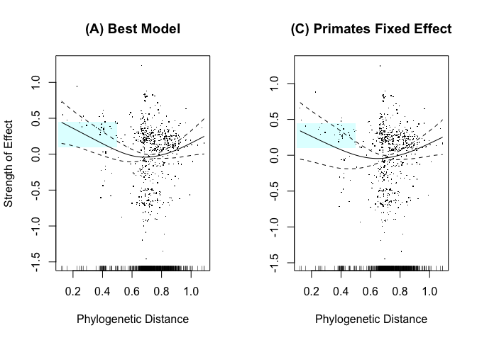

# Phylogenetic Distance / Primates

#### Reviewer Comments:

The result on phylogenetic distance to humans (Fig 2g) is presented as a central finding, but still raises issues. First, it is described as approximating ‘an exponential decay to an asymptote, with some upward drift for very phylogenetically distant mammals’ (line 129-130). This is not accurate – the curve appears roughly parabolic, with a minimum that appears to come before the bulk of the data. Thus the curve is rising through most of the data points. The text attributes this rise either to oversampling of marsupials (which clearly can’t explain the broad pattern) or to the idea that distantly related species pose a uniquely high risk for zoonoses. The latter argument is interesting, but breaks down if extended further to reptiles or insects or plants.

#### Response:
__This amounts to differences in the choice of words to describe plots; differences in interpretation?__

#### Reviewer Comments:
The authors have still not dispelled my previous critique that the meaningful pattern in this relationship (i.e. the downward slope for phylogenetic distance <0.5) is entirely due to non-human primates. Their response
argues that the order Primates did not show an effect in this model (not shown in the ms, but I’ll take their word for it) and therefore the influence of phylogeny is ‘robust across all data, and not necessarily driven by primates alone’. To be convinced of this, I would like to see a partial effect plot from a model with the order Primates included, with a credible interpretation of whatever phylogenetic pattern remains. Until then I don’t find the broad conclusions about the ‘strong predictive power of phylogenetic relatedness’ (line 134) to be supported, beyond apes > monkeys > other mammals. 

#### Response:
__Below are partial effect plots comparing the effect of *Phylogenetic Distance from Humans* in the authors' original model (A), a model that includes *Order Primates* as a random effect (B), and a model that includes *Order Primates* as a fixed effect (C).__

__The graphs below illustrate the minimal effect of including the *Order Primates* variable as a random effect; the *Order Primates* smooth is heavily penalized in our GAM and after applying shrinkage for model selection purposes, its EDF is ~ 0.0001. This is reflected in identical AIC for (A): 1517.584 and (B): 1517.584.__
<!-- -->

__The following comparison shows that when the *Order Primates* variable is included in the model as a fixed effect (C), there is a decrease in the effect of *Phylogenetic Distance from Humans* in the lower value range (highlighted); however, the overall phylogenetic pattern remains as previously reported. The coefficient for *Order Primates* as a fixed effect is 0.096; to put this in perspective, the partial effect of *Order Chiroptera* (considered as a random effect) in the best model is 0.116. Importantly, coercing *Order Primates* into the model negatively affects the overall fit of model (C), with an AIC of 1519.172 compared to 1517.584 for the best model (A).__

<!-- -->

