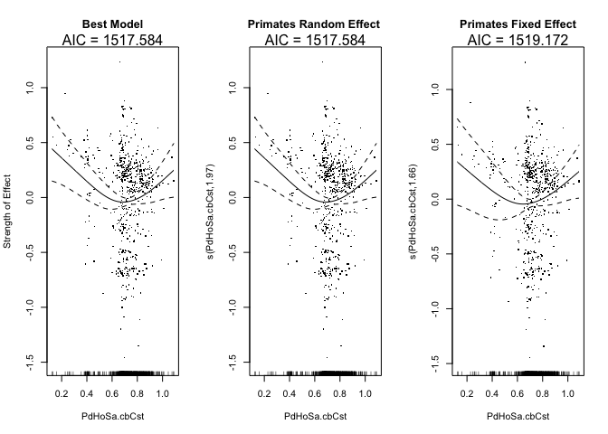

# Phylogenetic Distance / Primates

### Reviewer Comments:

The result on phylogenetic distance to humans (Fig 2g) is presented as a central finding, but still raises issues. First, it is described as approximating ‘an exponential decay to an asymptote, with some upward drift for very phylogenetically distant mammals’ (line 129-130). This is not accurate – the curve appears roughly parabolic, with a minimum that appears to come before the bulk of the data. Thus the curve is rising through most of the data points. The text attributes this rise either to oversampling of marsupials (which clearly can’t explain the broad pattern) or to the idea that distantly related species pose a uniquely high risk for zoonoses. The latter argument is interesting, but breaks down if extended further to reptiles or insects or plants.

__Differences in choice of words to describe plots; differences in interpretation.__

The authors have still not dispelled my previous critique that the meaningful pattern in this relationship (i.e. the downward slope for phylogenetic distance <0.5) is entirely due to non-human primates. Their response
argues that the order Primates did not show an effect in this model (not shown in the ms, but I’ll take their word for it) and therefore the influence of phylogeny is ‘robust across all data, and not necessarily driven by primates alone’. To be convinced of this, I would like to see a partial effect plot from a model with the order Primates included, with a credible interpretation of whatever phylogenetic pattern remains. Until then I don’t find the broad conclusions about the ‘strong predictive power of phylogenetic relatedness’ (line 134) to be supported, beyond apes > monkeys > other mammals. 

__The variable Order Primates, when added to the best model as a random effect, has very low effective degrees of freedom: 1.3\times 10^{-4}:__  
  

__The partial effect plot of phylogenetic distance with an Order Primates variable included as a Fixed Effect does not change substantially when compared to the partial effect plot in the original model__

<!-- -->

